# TÀI LIỆU PHÂN TÍCH MÔ HÌNH THỰC THỂ QUAN HỆ (ENTITY RELATIONSHIPS ANALYSIS)
## HỆ THỐNG LUYỆN NÃO & ĐỌC NHANH THÍCH ỨNG - BRAIN EXERCISES PRO

---

## 1. TỔNG QUAN HỆ THỐNG VÀ YÊU CẦU DỮ LIỆU

Hệ thống **Brain Exercises Pro** được thiết kế dựa trên các nguyên lý khoa học thần kinh (Neuroscience), kỹ thuật đọc nhanh hiện đại (Speed Reading Mechanics), và cơ chế thích ứng động (Dynamic Difficulty Adjustment - DDA).

Mô hình dữ liệu phải đáp ứng các tiêu chí cốt lõi:
1. **Toàn vẹn quan hệ (3NF)**: Chuẩn hóa dữ liệu bậc 3, loại bỏ hoàn toàn dư thừa dữ liệu (anomalies), duy trì tính nhất quán tuyệt đối giữa các phiên tập luyện, lịch sử điểm số và cấu hình bài tập.
2. **Khả năng mở rộng không giới hạn (Zero Artificial Limit)**: Cấu trúc cơ sở dữ liệu cho phép mở rộng không giới hạn số lượng bài tập, gói bài tập (workout routines), kho bài đọc, câu hỏi kiểm tra và hàng triệu lượt chơi của người dùng.
3. **Hiệu năng truy vấn cao**: Tối ưu hóa các bảng ghi log thời gian thực (`game_attempts`, `user_assessments`) bằng các chỉ mục phức hợp (composite indexes) theo `(user_id, created_at)` và `(exercise_id, score)`.
4. **Tương thích đa môi trường**: Hỗ trợ đầy đủ PostgreSQL trên Vercel Serverless (Neon, Supabase, Vercel Postgres) cũng như môi trường Docker Production và Local Development.

---

## 2. SƠ ĐỒ THỰC THỂ QUAN HỆ PLANTUML (ERD)

```puml
@startuml
!theme plain
skinparam linetype ortho
skinparam roundcorner 8
skinparam classFontSize 12
skinparam classFontName "Arial"

entity "users" as users {
  * id : UUID [PK]
  --
  * email : VARCHAR(255) [UK]
  * username : VARCHAR(100) [UK]
  * password_hash : VARCHAR(255)
  * avatar_url : VARCHAR(500)
  * total_xp : INT
  * current_level : INT
  * current_streak : INT
  * best_streak : INT
  * created_at : TIMESTAMPTZ
  * updated_at : TIMESTAMPTZ
}

entity "user_profiles" as user_profiles {
  * id : UUID [PK]
  --
  * user_id : UUID [FK, UK]
  * preferred_language : VARCHAR(10)
  * target_wpm : INT
  * daily_goal_minutes : INT
  * sound_enabled : BOOLEAN
  * theme : VARCHAR(20)
  * auto_difficulty_default : BOOLEAN
  * updated_at : TIMESTAMPTZ
}

entity "exercise_categories" as exercise_categories {
  * id : UUID [PK]
  --
  * code : VARCHAR(50) [UK]
  * name : VARCHAR(100)
  * description : TEXT
  * icon_name : VARCHAR(50)
  * sort_order : INT
}

entity "exercises" as exercises {
  * id : UUID [PK]
  --
  * category_id : UUID [FK]
  * slug : VARCHAR(100) [UK]
  * title : VARCHAR(150)
  * subtitle : VARCHAR(255)
  * icon_name : VARCHAR(50)
  * scientific_basis : TEXT
  * instructions : TEXT
  * max_difficulty_level : INT
  * default_duration_sec : INT
  * is_featured : BOOLEAN
  * created_at : TIMESTAMPTZ
}

entity "exercise_level_configs" as exercise_level_configs {
  * id : UUID [PK]
  --
  * exercise_id : UUID [FK]
  * level : INT
  * grid_rows : INT
  * grid_cols : INT
  * target_item_count : INT
  * time_limit_sec : INT
  * speed_wpm : INT
  * parameters_json : JSONB
  * created_at : TIMESTAMPTZ
}

entity "workout_routines" as workout_routines {
  * id : UUID [PK]
  --
  * code : VARCHAR(50) [UK]
  * title : VARCHAR(150)
  * duration_minutes : INT
  * star_rating : INT
  * description : TEXT
  * is_default : BOOLEAN
}

entity "workout_routine_items" as workout_routine_items {
  * id : UUID [PK]
  --
  * routine_id : UUID [FK]
  * exercise_id : UUID [FK]
  * order_index : INT
  * recommended_duration_sec : INT
}

entity "user_workout_sessions" as user_workout_sessions {
  * id : UUID [PK]
  --
  * user_id : UUID [FK]
  * routine_id : UUID [FK]
  * started_at : TIMESTAMPTZ
  * completed_at : TIMESTAMPTZ
  * total_score : INT
  * xp_earned : INT
  * status : VARCHAR(20)
}

entity "game_attempts" as game_attempts {
  * id : UUID [PK]
  --
  * user_id : UUID [FK]
  * exercise_id : UUID [FK]
  * session_id : UUID [FK, NULLABLE]
  * difficulty_level : INT
  * score : INT
  * accuracy_rate : DECIMAL(5,2)
  * time_spent_sec : DECIMAL(7,2)
  * effective_wpm : INT
  * raw_metrics_json : JSONB
  * created_at : TIMESTAMPTZ
}

entity "reading_texts" as reading_texts {
  * id : UUID [PK]
  --
  * title : VARCHAR(255)
  * category : VARCHAR(100)
  * word_count : INT
  * difficulty_level : INT
  * content : TEXT
  * preview_excerpt : VARCHAR(500)
  * author : VARCHAR(150)
  * created_at : TIMESTAMPTZ
}

entity "reading_questions" as reading_questions {
  * id : UUID [PK]
  --
  * reading_text_id : UUID [FK]
  * question_order : INT
  * question_text : TEXT
  * option_a : VARCHAR(255)
  * option_b : VARCHAR(255)
  * option_c : VARCHAR(255)
  * option_d : VARCHAR(255)
  * correct_option : VARCHAR(1)
  * explanation : TEXT
}

entity "user_assessments" as user_assessments {
  * id : UUID [PK]
  --
  * user_id : UUID [FK]
  * reading_text_id : UUID [FK]
  * reading_time_sec : DECIMAL(7,2)
  * raw_wpm : INT
  * comprehension_score : DECIMAL(5,2)
  * effective_wpm : INT
  * answers_json : JSONB
  * completed_at : TIMESTAMPTZ
}

entity "daily_streaks" as daily_streaks {
  * id : UUID [PK]
  --
  * user_id : UUID [FK]
  * streak_date : DATE
  * minutes_trained : INT
  * exercises_completed : INT
  * xp_earned : INT
}

entity "user_reminders" as user_reminders {
  * id : UUID [PK]
  --
  * user_id : UUID [FK]
  * reminder_time : TIME
  * days_of_week_mask : INT
  * is_enabled : BOOLEAN
  * label : VARCHAR(100)
  * created_at : TIMESTAMPTZ
}

entity "achievements" as achievements {
  * id : UUID [PK]
  --
  * code : VARCHAR(50) [UK]
  * title : VARCHAR(150)
  * description : TEXT
  * badge_icon : VARCHAR(100)
  * xp_reward : INT
  * category : VARCHAR(50)
}

entity "user_achievements" as user_achievements {
  * id : UUID [PK]
  --
  * user_id : UUID [FK]
  * achievement_id : UUID [FK]
  * unlocked_at : TIMESTAMPTZ
}

users ||--|| user_profiles
users ||--o{ user_workout_sessions
users ||--o{ game_attempts
users ||--o{ user_assessments
users ||--o{ daily_streaks
users ||--o{ user_reminders
users ||--o{ user_achievements

exercise_categories ||--o{ exercises
exercises ||--o{ exercise_level_configs
exercises ||--o{ game_attempts
exercises ||--o{ workout_routine_items

workout_routines ||--o{ workout_routine_items
workout_routines ||--o{ user_workout_sessions

reading_texts ||--o{ reading_questions
reading_texts ||--o{ user_assessments

achievements ||--o{ user_achievements
@enduml
```

---

## 3. ĐẶC TẢ CHI TIẾT CÁC THỰC THỂ & QUAN HỆ

### 1. `users` (Tài khoản người dùng)
- **Mục đích**: Lưu trữ thực thể người dùng, định danh bảo mật, tích lũy điểm kinh nghiệm (XP), tính cấp bậc và streak ngày liên tiếp.
- **Các trường chính**:
  - `id`: UUID (Primary Key, sinh ngẫu nhiên).
  - `email`: VARCHAR(255) UNIQUE NOT NULL.
  - `username`: VARCHAR(100) UNIQUE NOT NULL.
  - `password_hash`: VARCHAR(255) NOT NULL (mã hóa bcrypt).
  - `avatar_url`: VARCHAR(500) NULL.
  - `total_xp`: INT DEFAULT 0 (Dùng để tính level = $\lfloor \sqrt{total\_xp / 100} \rfloor + 1$).
  - `current_level`: INT DEFAULT 1.
  - `current_streak`: INT DEFAULT 0 (Chuỗi ngày tập luyện liên tiếp).
  - `best_streak`: INT DEFAULT 0 (Kỷ lục streak dài nhất).
- **Ràng buộc & Chỉ mục**:
  - `idx_users_email` (BTREE trên email).
  - `idx_users_xp` (BTREE giảm dần phục vụ Bảng Xếp Hạng Leaderboard).

### 2. `user_profiles` (Tùy chọn & Cấu hình cá nhân)
- **Mục đích**: Lưu trữ tùy biến cá nhân hóa trải nghiệm.
- **Quan hệ**: 1-to-1 với `users` (ON DELETE CASCADE).
- **Các trường chính**:
  - `preferred_language`: 'vi' | 'en' (Mặc định: 'vi').
  - `target_wpm`: INT DEFAULT 450 (Mục tiêu tốc độ đọc mong muốn).
  - `daily_goal_minutes`: INT DEFAULT 15 (Mục tiêu phút rèn luyện mỗi ngày).
  - `sound_enabled`: BOOLEAN DEFAULT true.
  - `theme`: 'light' | 'dark' | 'sepia' (Mặc định: 'light').
  - `auto_difficulty_default`: BOOLEAN DEFAULT true (Tự động thích ứng độ khó).

### 3. `exercise_categories` (Nhóm kỹ năng nhận thức)
- **Mục đích**: Phân nhóm 15 bài tập theo 5 trục kỹ năng nhận thức để vẽ biểu đồ Radar:
  1. `SPEED_READING`: Tốc độ đọc & Triệt tiêu đọc thầm.
  2. `PERIPHERAL_VISION`: Thị giác ngoại biên & Mở rộng trường nhìn.
  3. `MEMORY`: Trí nhớ làm việc & Lưu trữ ngắn hạn.
  4. `ATTENTION`: Chú ý tập trung & Phân biệt thị giác chọn lọc.
  5. `REACTION`: Tốc độ phản xạ & Kiểm soát ức chế.

### 4. `exercises` (Danh mục bài tập)
- **Mục đích**: Định nghĩa 15 trò chơi luyện não từ các hình ảnh phân tích.
- **Danh sách 15 mã bài tập chuẩn**:
  - `anagram`: Đảo ngữ
  - `schulte-table`: Bảng Schulte
  - `find-letter`: Tìm chữ
  - `find-number`: Tìm Số
  - `even-odd`: Chẵn/Lẻ
  - `digit-span`: Nhớ Số
  - `rsvp-speed-reader`: Chữ Chạy
  - `word-search`: Tìm Từ
  - `twin-words`: Từ Sinh đôi
  - `peripheral-vision`: Tầm Nhìn
  - `green-dot`: Điểm xanh
  - `word-chunking`: Chuỗi từ
  - `reading-assessment`: Đánh giá tốc độ đọc
  - `reading-pacer`: Tăng tốc độ đọc
  - `text-scanning`: Tìm trong văn bản

### 5. `exercise_level_configs` (Tham số 8 cấp độ khó)
- **Mục đích**: Cấu hình chi tiết các tham số vận hành cho từng cấp độ (1 đến 8) của mỗi trò chơi, tương thích chính xác với màn hình Cài đặt trong ảnh mẫu (Ảnh số 4).
- **Các trường chính**:
  - `level`: INT (1 đến 8).
  - `grid_rows`, `grid_cols`: Kích thước bảng (ví dụ 12x20 cho Tìm Từ, 5x5 cho Schulte).
  - `target_item_count`: Số từ mục tiêu, số lượng ký tự cần tìm.
  - `time_limit_sec`: Thời gian giới hạn đếm ngược (ví dụ 60 giây).
  - `speed_wpm`: Tốc độ hiển thị từ cho bài đọc RSVP (từ 150 WPM đến 1200 WPM).
  - `parameters_json`: Cấu hình mở rộng dạng JSONB (mức độ nhiễu ký tự, khoảng cách góc nhìn ngoại vi, font chữ, hướng ẩn từ).

### 6. `workout_routines` & `workout_routine_items` (Gói giáo trình luyện tập)
- **Mục đích**: Quản trị 4 chương trình tập luyện hiển thị trên Trang Chủ (Ảnh số 2 và 3):
  1. `QUICK_5M`: Nhanh (5 phút - 1 sao)
  2. `REGULAR_10M`: Theo dõi / Định kỳ (10-15 phút - 2 sao)
  3. `OPTIMAL_30M`: Tối ưu (30 phút - 3 sao)
  4. `INTENSIVE_60M`: Cường độ (60 phút - 4 sao)
- **Quan hệ**: 1-to-N giữa `workout_routines` và `workout_routine_items`, chỉ định thứ tự các bài tập trong mỗi gói.

### 7. `game_attempts` (Nhật ký lượt tập luyện)
- **Mục đích**: Lưu trữ từng lượt chơi để phân tích biểu đồ tiến bộ, tỷ lệ chính xác, tốc độ và cấp độ thích ứng.
- **Các trường chính**:
  - `difficulty_level`: Cấp độ lúc làm bài (1-8).
  - `score`: Điểm số đạt được.
  - `accuracy_rate`: Tỷ lệ chính xác (0.00% - 100.00%).
  - `time_spent_sec`: Thời gian hoàn thành bài tập.
  - `effective_wpm`: WPM đạt được nếu là bài đọc.
  - `raw_metrics_json`: Lưu chi tiết từng cú nhấp, thời gian phản ứng cho từng item (phục vụ phân tích khoa học não bộ).
- **Chỉ mục tối ưu**: `idx_attempts_user_date` trên `(user_id, created_at DESC)`.

### 8. `reading_texts` & `reading_questions` (Kho dữ liệu đọc hiểu chuẩn)
- **Mục đích**: Cung cấp các văn bản chuẩn hóa bằng tiếng Việt và tiếng Anh có số lượng từ xác định, kèm theo các câu hỏi trắc nghiệm kiểm tra độ hiểu 4 đáp án (A, B, C, D) để tính chỉ số:
$$\text{Effective WPM} = \text{Raw WPM} \times \frac{\text{Comprehension \%}}{100}$$

### 9. `daily_streaks` & `user_reminders` (Thói quen & Thông báo)
- **Mục đích**: Quản lý vòng lặp thói quen tích cực (Habit Loop), thông báo đẩy Web Notification vào các khung giờ đã cài đặt trên màn hình Trang Chủ ("Nhắc nhở").

---

## 4. CHIẾN LƯỢC MÃ HÓA & TÍNH TOÀN VẸN TRÊN VERCEL SERVERLESS

- **Serverless Resilience**: Khi chạy trên môi trường Vercel Functions không trạng thái (stateless), pool kết nối được tối ưu hóa qua cấu hình `max: 5` hoặc thông qua kết nối Pooled URL của Neon/Supabase.
- **Fail-safe Mode**: Hệ thống backend tích hợp cơ chế tự động chuyển đổi sang Mock In-Memory Store nếu biến môi trường `DATABASE_URL` chưa được cung cấp, giúp ứng dụng không bao giờ bị lỗi HTTP 500 khi người dùng lần đầu deploy lên Vercel.
