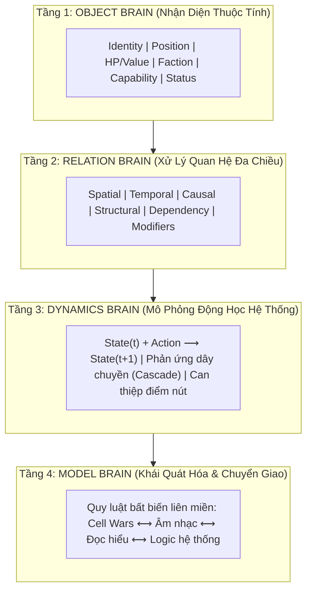
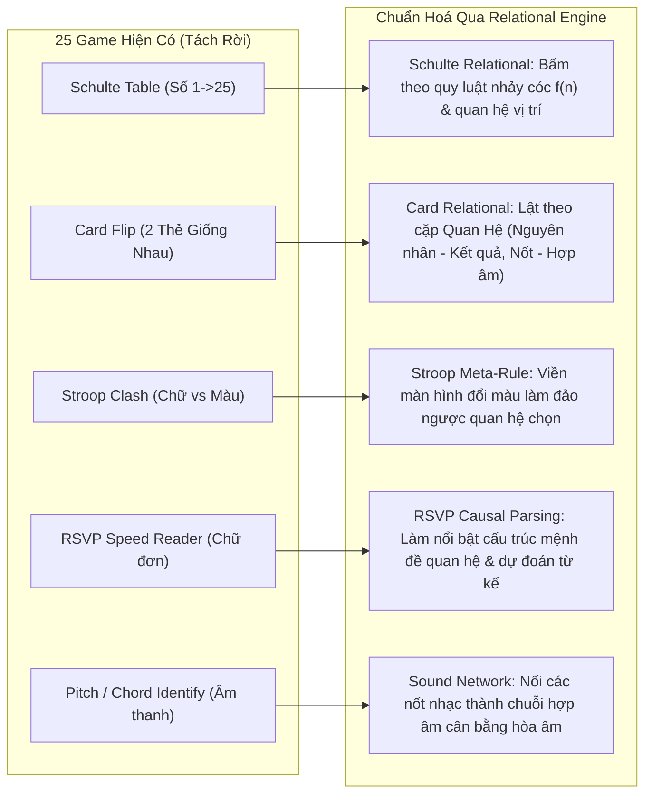
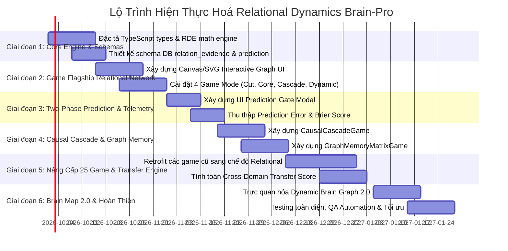

# CHIẾN LƯỢC HIỆN THỰC HOÁ: RELATIONAL DYNAMICS ENGINE & COGNITIVE PREDICTION
## Kế hoạch Phát triển Hệ thống Luyện Não & Mô phỏng Tư duy Nhận thức Toàn diện cho Brain-Pro

---

## 1. PHÂN TÍCH BẢN CHẤT Ý TƯỞNG TỪ `đánh giá 1.txt`

Tài liệu `đánh giá 1.txt` đưa ra một phát kiến cốt lõi: **Không sao chép cơ học một tựa game (như Cell Expansion Wars), mà bóc tách cơ chế nhận thức đằng sau nó thành một hệ thống mô phỏng tư duy (Mental Simulation Engine)**.

### 1.1. Sự chuyển dịch mô hình nhận thức (Cognitive Paradigm Shift)

| Tiêu chí | Game luyện não truyền thống (Hiện trạng) | Hệ thống Relational Dynamics (Đề xuất) |
| :--- | :--- | :--- |
| **Cơ chế cốt lõi** | Kích thích $\rightarrow$ Phản xạ $\rightarrow$ Ghi điểm (*Stimulus-Response*) | Quan sát $\rightarrow$ Mô hình hóa $\rightarrow$ **Dự đoán** $\rightarrow$ Can thiệp $\rightarrow$ **Cập nhật mô hình** (*Predictive Coding*) |
| **Đối tượng xử lý** | Thực thể đơn lẻ (Con số, Chữ cái, Màu sắc, Ô vuông) | **Mạng lưới: Thực thể + Thuộc tính quan hệ + Trạng thái động** |
| **Bản chất đường nối** | Đồ họa nối vô tri (Visual line) | **Thực thể quan hệ (Relation Entity) có State, Capacity, Direction, Modifiers** |
| **Thước đo tiến bộ** | Tốc độ bấm (Reaction time) & Điểm số (Score/XP) | **Sai số dự đoán (Prediction Error $\downarrow$) & Độ bền chuyển giao (Transfer Score $\uparrow$)** |
| **Cách "Ghim vào não"** | Lặp lại 1 dạng bài hàng ngàn lần (*Overfitting*) | **Khai thác cùng 1 Quan hệ trừu tượng trên nhiều miền kích thích khác nhau** |

### 1.2. Kiến trúc 4 Tầng Nhận Thức ("4 Brains Model")



---

## 2. KIẾN TRÚC KỸ THUẬT: RELATIONAL DYNAMICS ENGINE (RDE)

Hệ thống RDE được thiết kế như một subsystem độc lập trong thư mục `shared/src/cognition/rde/`, đóng vai trò là "bộ não tính toán trạng thái" dùng chung cho cả backend lẫn frontend.

### 2.1. Bản thể học (Ontology) & TypeScript Interfaces

```typescript
// 1. Thực thể trong thế giới nhận thức
export interface IRdeEntity {
  id: string;
  type: 'NODE' | 'CONCEPT' | 'OBSTACLE' | 'CORE' | 'MODIFIER';
  faction: 'PLAYER' | 'NEUTRAL' | 'ADVERSARY';
  position: { x: number; y: number };
  state: {
    value: number;          // HP, dung lượng, hoặc năng lượng
    maxValue: number;
    status: 'ACTIVE' | 'FROZEN' | 'SHIELDED' | 'OVERLOADED';
    role: 'NORMAL' | 'ATTACKER' | 'HEALER' | 'DEFENDER' | 'AMPLIFIER';
    capacity: number;       // Số kết nối tối đa có thể phát ra
  };
  metadata?: Record<string, unknown>;
}

// 2. Thực thể Quan hệ (Edge có State và Property thực sự)
export interface IRdeRelation {
  id: string;
  sourceId: string;
  targetId: string;
  type: 
    | 'FLOW_CONNECT'      // Truyền dẫn tài nguyên
    | 'ATTACK_DRAIN'      // Hút/giảm giá trị đích
    | 'HEAL_BUFF'         // Tăng giá trị đích
    | 'CONTROL_DEPEND'    // Kiểm soát sinh tử (Core -> Peripheral)
    | 'INHIBIT_BLOCK'     // Ngăn chặn trạng thái
    | 'TRANSFORM_ALIGN';  // Chuyển đổi phe/bản chất
  properties: {
    strength: number;     // Tốc độ truyền dẫn (đơn vị/giây)
    distance: number;     // Khoảng cách hình học hoặc trừu tượng
    direction: 'DIRECTED' | 'BIDIRECTIONAL';
    isActive: boolean;
    cuttable: boolean;
    cutAffinity: 'SOURCE_BIASED' | 'TARGET_BIASED' | 'BALANCED'; // Vị trí cắt tạo kết quả khác nhau
  };
}

// 3. Hành động can thiệp (Action có Parameter chi tiết)
export interface IRdeAction {
  actionType: 'CONNECT' | 'CUT' | 'FREEZE' | 'TRANSFORM' | 'DISRUPT';
  sourceEntityId?: string;
  targetEntityId?: string;
  relationId?: string;
  parameters: {
    cutRatio?: number;      // 0.0 (sát source) đến 1.0 (sát target)
    timingMs?: number;
    resourceCommitted?: number;
  };
}

// 4. Công thức chuyển đổi trạng thái cốt lõi
export interface IRdeSystemTransition {
  stateBefore: {
    entities: IRdeEntity[];
    relations: IRdeRelation[];
  };
  action: IRdeAction;
  predictedState?: {
    affectedEntityIds: string[];
    valueDeltas: Record<string, number>;
  };
  stateAfter: {
    entities: IRdeEntity[];
    relations: IRdeRelation[];
  };
  predictionError: number;   // Sai số giữa dự đoán của người học và thực tế vật lý hệ thống
}
```

### 2.2. Vòng lặp Nhận thức Hai Pha (Two-Phase Prediction Loop)

Khác với các mini-game thông thường bấm ngay khi thấy kích thích, RDE tích hợp **Pha Dự Đoán (Prediction Gate)**:

```
[Màn hình xuất hiện State 0]
          │
          ▼
┌──────────────────────────────────────────────┐
│  PHA 1: TƯ DUY MÔ PHỎNG (MENTAL SIMULATION)  │
│  - Người học chọn điểm can thiệp dự kiến      │
│  - Câu hỏi dự đoán:                          │
│    "Nếu cắt tại vị trí X, node nào thắng?"    │
│    "Sau 3 giây, chuỗi phản ứng dừng ở đâu?"  │
│  - Chọn độ tin cậy (Confidence: 20% - 100%)  │
└──────────────────────────────────────────────┘
          │
          ▼
┌──────────────────────────────────────────────┐
│  PHA 2: HÀNH ĐỘNG THỰC TẾ (ACTION TRIAL)     │
│  - Người chơi thực hiện thao tác tương tác   │
│  - Engine kích hoạt hiệu ứng động lực học    │
└──────────────────────────────────────────────┘
          │
          ▼
┌──────────────────────────────────────────────┐
│  PHA 3: BẰNG CHỨNG HỌC TẬP (TELEMETRY)       │
│  - Tính toán: Prediction Error = |Pred - Act|│
│  - Đo Brier Score (Độ hiệu chuẩn tự tin)     │
│  - Ghi nhận Evidence vào Cognitive Brain Map │
└──────────────────────────────────────────────┘
```

---

## 3. DANH MỤC CÁC BÀI TẬP & TỰA GAME MỚI (THIẾT THỰC NHẤT)

Thay vì làm các bài tập trừu tượng khó hiểu, dự án sẽ xây dựng **4 tựa game đỉnh cao mới**, đồng thời nâng cấp **25 bài tập hiện tại** của Brain-Pro theo chuẩn Relational Engine.

### 3.1. Game Mới 1: `RelationalNetworkGame` (Chiến Tranh Mạng Lưới Nhận Thức)
- **Mã định danh**: `relational-network`
- **Quan hệ chủ đạo**: `TARGET_POSITION`, `RULE_ACTION`, `PART_WHOLE`, `SPATIAL_TRANSFORM`, `TEMPORAL_PREDICT`.
- **Giao diện & Thẩm mỹ**: Canvas 2D/WebGL với phong cách Cyber-Synapse (các tế bào nơ-ron phát sáng neon, các nhánh axon truyền xung thần kinh phát hạt sáng particle mượt mà, đường cắt laser sắc lẹm).
- **4 Chế độ chơi từ cơ bản đến cao cấp**:
  1. **Surgical Cut (Phẫu Thuật Xúc Tu)**: Người chơi chọn vị trí cắt trên liên kết giữa 2 tế bào. Cắt sát tế bào mẹ (ratio < 0.3) sẽ dồn xung lực hồi máu cho toàn bộ mạng nhà; cắt sát tế bào địch (ratio > 0.7) sẽ phóng đạn shockwave triệt hạ tiền đồn đối phương. Luyện khả năng ước lượng tỷ lệ không gian và quan hệ nhân quả.
  2. **Core Dominance (Đòn Bẩy Nút Lõi)**: Một mạng lưới gồm 8-15 nút phụ thuộc lẫn nhau. Người chơi không đủ tài nguyên chiếm từng nút mà phải phân tích cấu trúc đồ thị (Centrality / Bottleneck) để chiếm đúng Node Lõi (Core), lập tức đảo chiều kiểm soát toàn mạng. Luyện tư duy hệ thống và phân tích sự phụ thuộc.
  3. **Cascade Prediction (Dự Đoán Dây Chuyền)**: Trạng thái đóng băng 5 giây. Người chơi phải nhẩm trong đầu: Nếu kích hoạt nút A $\rightarrow$ A phá vỡ liên kết B $\rightarrow$ C mất tiếp năng lượng và bị địch nuốt. Người chơi phải click vào nút cuối cùng sẽ bị sụp đổ trước khi thời gian bắt đầu chạy.
  4. **Dynamic World Shift**: Các chướng ngại vật di động (tường năng lượng, vùng nhiễu) xoay tròn trên bàn cờ. Các liên kết bị ngắt khi chạm chướng ngại vật, buộc não phải liên tục cập nhật topo không gian (Mental Topology Updating).

### 3.2. Game Mới 2: `CausalCascadeGame` (Hiệu Ứng Domino Nhân Quả)
- **Mã định danh**: `causal-cascade`
- **Quan hệ chủ đạo**: `RULE_ACTION`, `TEMPORAL_PREDICT`, `INHIBITION`, `CONTEXT_MEANING`.
- **Cơ chế**:
  - Người chơi đối diện với một mạch logic kết hợp cơ học và thông tin (Ví dụ: Cần gạt nước $\rightarrow$ Ròng rọc $\rightarrow$ Bánh răng $\rightarrow$ Cảm biến quang $\rightarrow$ Đèn báo).
  - Có các quy tắc điều kiện biến đổi: *"Khi đèn đỏ bật thì van B bị đảo chiều", "Nếu ròng rọc quay quá 3 vòng thì khóa tự ngắt"*.
  - Thử thách: Tìm **1 can thiệp tối thiểu** (Minimum Intervention) để cứu vãn hệ thống khỏi quá tải hoặc dẫn năng lượng về đích đúng thời gian quy định.

### 3.3. Game Mới 3: `GraphMemoryMatrix` (Trí Nhớ Làm Việc Mạng Đồ Thị)
- **Mã định danh**: `graph-memory-matrix`
- **Quan hệ chủ đạo**: `ORDER_SEQUENCE`, `SPATIAL_TRANSFORM`, `IDENTITY_MATCH`, `PART_WHOLE`.
- **Cơ chế**:
  - Khác với `DigitSpanGame` chỉ nhớ chuỗi 1 chiều $1 \rightarrow 7 \rightarrow 4$, game này chiếu một đồ thị gồm 5-8 nút liên kết (Ví dụ: A nối B, B nối C & D, D nối E) trong 3.5 giây rồi ẩn toàn bộ các cạnh nối.
  - Câu hỏi nhận thức gián tiếp:
    - *"Để đi từ A đến E cần đi qua nút nào?"*
    - *"Nếu nút B bị ngắt, có thể đi từ A đến D được không?"*
    - *"Đồ thị vừa xem có chu trình khép kín (loop) không?"*
  - Rèn luyện trí nhớ không gian cấu trúc (Relational Graph Working Memory) — yếu tố sống còn cho lập trình viên, kỹ sư và nhà quản trị chiến lược.

### 3.4. Game Mới 4: `RuleMutationClash` (Xung Đột Quy Tắc Biến Dị)
- **Mã định danh**: `rule-mutation-clash`
- **Quan hệ chủ đạo**: `RULE_ACTION`, `INHIBITION`, `SIMILARITY_DIFF`.
- **Cơ chế**:
  - Chống thói quen học vẹt (Rote Learning): Bình thường Màu Đỏ = Tấn công, Xanh = Phòng thủ.
  - Đột ngột xuất hiện tín hiệu "Mutation Trigger": Các quy tắc hoán đổi vị trí theo một ma trận điều kiện mới.
  - Đo lường chính xác `Interference Cost` (chi phí thời gian và tỷ lệ sai sót khi não bộ phải ức chế quy tắc cũ để nạp quy tắc mới).

---

## 4. HIỆN THỰC HOÁ TRÊN 25 GAME HIỆN CÓ CỦA BRAIN-PRO

Để dự án trở thành một khối thống nhất hữu cơ, 25 game hiện tại sẽ được nâng cấp thêm các biến thể quan hệ (Relational Modes):



---

## 5. THANG ĐO 10 CHIỀU THÍCH ỨNG (10-DIMENSIONAL ADAPTIVE DIFFICULTY)

Loại bỏ hoàn toàn tư duy nghiệp dư: *"Độ khó cao hơn = Cho chạy nhanh hơn / Ít thời gian hơn"*. RDE áp dụng vector độ khó 10 chiều:

$$\vec{D} = \langle N_e, N_r, A_r, S_c, T_d, D_i, H_i, P_d, R_m, T_r \rangle$$

1. **Số lượng thực thể ($N_e$)**: 3 nút $\rightarrow$ 5 nút $\rightarrow$ 15 nút.
2. **Số lượng quan hệ ($N_r$)**: Đồ thị cây đơn giản $\rightarrow$ Đồ thị mắt lưới chéo chùm.
3. **Độ mập mờ quan hệ ($A_r$)**: Mũi tên rõ ràng $\rightarrow$ Quan hệ ẩn suy ra từ thuộc tính.
4. **Độ phức tạp trạng thái ($S_c$)**: Chỉ có máu (HP) $\rightarrow$ Thêm trạng thái đóng băng, khiên, khuếch đại.
5. **Độ trễ thời gian ($T_d$)**: Tác động tức thì $\rightarrow$ Hiệu ứng có độ trễ truyền dẫn sóng (Propagation Delay).
6. **Tác nhân gây nhiễu ($D_i$)**: Các nút giả, đường nối không mang năng lượng.
7. **Thông tin bị ẩn ($H_i$)**: Che khuất một phần mạng lưới, buộc não phải nội suy (Mental Extrapolation).
8. **Độ sâu dự đoán ($P_d$)**: Dự đoán 1 bước kế tiếp $\rightarrow$ Dự đoán chuỗi phản ứng 4 bước liên hoàn.
9. **Biến dị quy tắc ($R_m$)**: Quy tắc ổn định $\rightarrow$ Quy tắc đột biến giữa phiên chơi.
10. **Khoảng cách chuyển giao ($T_r$)**: Kiểm tra quan hệ vừa học trên hình ảnh sang âm thanh, con số và câu từ.

---

## 6. KẾ HOẠCH TRIỂN KHAI TOÀN DIỆN (ACTIONABLE ROADMAP)



### Chi tiết các bước thực hiện:

#### Giai đoạn 1: Chuẩn hoá Schema & Xây dựng Core Engine (`shared/src/cognition/rde`)
- **Mục tiêu**: Định nghĩa toán học và logic chuyển trạng thái độc lập với UI.
- **Tạo mới**:
  - `shared/src/cognition/rde/types.ts`: Toàn bộ interfaces thực thể, quan hệ, hành động, trạng thái.
  - `shared/src/cognition/rde/transition-solver.ts`: Hàm thuần túy $f(S_t, A) \rightarrow S_{t+1}$.
  - `shared/src/cognition/rde/prediction-metric.ts`: Tính toán sai số dự đoán chuẩn hóa $[0, 1]$ và Brier calibration score.
- **Cơ sở dữ liệu**: Bổ sung các cột trong `game_attempts` hoặc tạo bảng `prediction_evidences` ghi nhận: `predicted_outcome`, `actual_outcome`, `prediction_error`, `confidence_level`.

#### Giai đoạn 2: Phát triển Game Flagship `RelationalNetworkGame.tsx`
- **Mục tiêu**: Đưa trải nghiệm mạng lưới thực thể sống động lên giao diện React với tính thẩm mỹ đỉnh cao.
- **Tạo mới**:
  - `frontend/src/components/games/RelationalNetworkGame.tsx`: Canvas 60 FPS, vẽ node với hiệu ứng glow, đường nối bezier có hạt năng lượng di chuyển thể hiện chiều và tốc độ truyền dẫn.
  - Hỗ trợ thao tác kéo-thả để nối (Connect), vuốt ngang để cắt xúc tu (Slice/Cut), click chọn nút can thiệp.

#### Giai đoạn 3: Tích hợp Cơ chế Dự đoán Hai Pha (Prediction Gate)
- **Mục tiêu**: Ép não bộ phải tư duy mô phỏng trước khi ra đòn.
- **Tạo mới**:
  - `frontend/src/components/cognition/PredictionGateOverlay.tsx`: Component hiển thị câu hỏi dự đoán trạng thái hệ thống trước khi bắt đầu đếm ngược hành động.
  - Kết nối dữ liệu vào `useRelationSession` để tự động đẩy telemetry về backend.

#### Giai đoạn 4: Bộ Đôi Game Suy Luận Nhân Quả & Trí Nhớ Đồ Thị
- **Mục tiêu**: Mở rộng sang năng lực giải quyết vấn đề phức tạp và trí nhớ làm việc cấu trúc.
- **Tạo mới**:
  - `frontend/src/components/games/CausalCascadeGame.tsx`: Mô phỏng mạch nguyên nhân - hệ quả.
  - `frontend/src/components/games/GraphMemoryMatrixGame.tsx`: Thử thách ghi nhớ mạng lưới liên kết và truy vấn quan hệ gián tiếp.

#### Giai đoạn 5: Động Cơ Chuyển Giao Tri Thức (Cognitive Transfer Engine)
- **Mục tiêu**: Kiểm chứng hiện tượng "ghim vào não" thực thụ.
- **Cài đặt**:
  - Tạo các bài tập chuỗi liên hoàn (Cross-Domain Routines): Ví dụ Routine "Mastering Dependency" gồm 3 chặng:
    1. Chặng 1: `RelationalNetworkGame` (Nút con phụ thuộc Nút Lõi).
    2. Chặng 2: `CausalCascadeGame` (Sự kiện B phụ thuộc Điều kiện A).
    3. Chặng 3: `ReadingAssessmentGame` (Xác định mệnh đề phụ thuộc trong đoạn văn phức tạp).
  - So sánh tỷ lệ suy giảm hiệu năng giữa các chặng để tính `TransferRatio`.

#### Giai đoạn 6: Brain Map 2.0 & Trực Quan Hóa Mạng Lưới Nhận Thức
- **Mục tiêu**: Người dùng nhìn thấy bộ não nhận thức của mình dưới dạng một mạng lưới sống động.
- **Nâng cấp**:
  - `frontend/src/components/cognition/BrainMap.tsx`: Chuyển từ biểu đồ radar 5 trục hoặc 12 điểm cô lập sang một **Dynamic Knowledge Graph 3D/2D Force-Directed**.
  - Các node đại diện cho 12 Quan hệ; các đường nối sáng lên khi khả năng chuyển giao (Transfer Bridge) giữa hai bài tập được kích hoạt thành công.

---

## 7. KẾT LUẬN & ĐỀ XUẤT QUYẾT ĐỊNH

Tài liệu `đánh giá 1.txt` đã vạch ra một định hướng cực kỳ sâu sắc và hoàn toàn tương thích với kiến trúc 12 Quan hệ nhận thức hiện hữu của Brain-Pro. Việc hiện thực hoá nó sẽ đưa Brain-Pro vượt xa khỏi các ứng dụng mini-game phản xạ thông thường trên thị trường, trở thành một **Nền tảng Huấn Luyện Năng Lực Nhận Thức Chuyên Sâu dựa trên Khoa Học Thần Kinh Tính Toán (Computational Cognitive Neuroscience)**.
