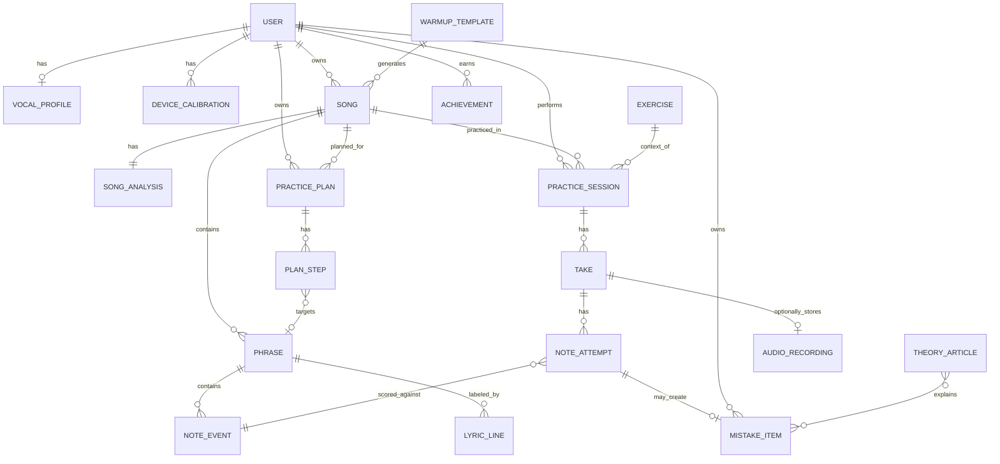

# STUDIO LUYỆN HÁT VOCAL MP3 (AI PITCH COACH) — PHÂN TÍCH & KẾ HOẠCH HOÀN THIỆN

> **Phạm vi:** chức năng "Studio Luyện Hát Vocal MP3" nằm trong bài tập *Cảm Âm & Dò Cao Độ Giọng Hát* (nhóm Trí Nhớ Âm Thanh, Cấp 12/12) của Brain Pro.
> **Nguồn phân tích:** 2 ảnh chụp màn hình — (1) tab **Phòng Luyện Hát**, (2) tab **Phân Tích & Kế Hoạch**. Tab **Báo Cáo**, khối **Trình Điều Hướng Phân Đoạn & Câu Hát** và Bước 4 của kế hoạch bị cắt/không thấy trong ảnh nên chỉ đánh giá ở mức suy luận (ghi rõ ở từng chỗ).
> **Stack tham chiếu:** React 18 + Vite + Zustand · NestJS 11 · PostgreSQL (Supabase) · Vercel Serverless.

---

## 0. TÓM TẮT ĐIỀU HÀNH

**Đánh giá chung:** ý tưởng đúng hướng và đã có "xương sống" của một app luyện hát hiện đại (pitch roll, đo cents, A-B loop, đổi tốc độ, octave-fold, kế hoạch tập). Tuy nhiên hiện tại chức năng **chưa đáng tin về mặt dữ liệu** (có số liệu mâu thuẫn nhau ngay trên màn hình), **chưa tối ưu về trải nghiệm hát thực tế** (độ trễ, nhiễu loa, vùng nhìn trước), và **chưa kết nối** với phần còn lại của app (Lý thuyết, Lịch sử sai, Hồ sơ, Cài đặt, hệ thống cấp độ).

**5 vấn đề ưu tiên cao nhất (P0):**

| # | Vấn đề | Vì sao nghiêm trọng |
|---|--------|---------------------|
| 1 | Màn hình báo **"Chuẩn cao độ!" / 0 cents** trong khi **Chuẩn tông chỉ 6%** và giọng đang hát lệch nốt mẫu | Phản hồi sai làm hỏng toàn bộ giá trị của công cụ luyện (xem mục 3.1) |
| 2 | Nhãn nốt **G2** nhưng phím âm giai sáng **F#**; 95.7 Hz thực ra ≈ MIDI 42.6 (G2 lệch −40 cents) | Làm tròn nốt không nhất quán giữa các thành phần UI |
| 3 | **Đường cao độ mẫu bị vỡ vụn** (chấm rời, nét lượn, điểm ngoại lai) vì trích từ bài hát đầy đủ nhạc đệm | Người dùng không biết "phải hát gì"; phân tích khoảng giọng/độ khó cũng sai theo |
| 4 | **Kế hoạch luyện tập mâu thuẫn:** file `C3_G4` nhưng báo quãng giọng `E2–D#5` (35 bán âm); Bước 2 liệt kê nốt `C#3, A#2, D#3, G#2, F#2` trong khi bài ở C Major; Bước 2 nói 0.8x nhưng Bước 3 nói 0.85x, và thanh tốc độ không có 0.8x | Người dùng mất niềm tin vào "AI Coach" |
| 5 | **Thanh tab/header bị cắt** ("Báo Cáo" tràn ra ngoài, "Phân Tích & Kế Hoạch" xuống 3 dòng), modal cố định chiều cao làm nội dung cuối bị cắt | Lỗi bố cục làm mất luồng Phân tích → Luyện → Báo cáo |

**Hướng đi đề xuất (một câu):** *"Sửa tính đúng đắn trước → làm lại lõi trải nghiệm hát (pitch roll + điều khiển) → nâng chất lượng trích xuất cao độ → nối vào các thực thể còn lại (Hồ sơ, Lịch sử sai, Lý thuyết, Cấp độ) → mở rộng thư viện bài khởi động, tách giọng, lời bài hát."*

---

## 1. HIỆN TRẠNG CHỨC NĂNG (KIỂM KÊ TỪ ẢNH)

### 1.1 Tab "Phân Tích & Kế Hoạch" (ảnh 2)

| Khối | Nội dung quan sát được |
|------|------------------------|
| Header | Tên "Studio Luyện Hát Vocal MP3", badge `AI PITCH COACH`, tên file đang xử lý, 3 tab (Phân Tích & Kế Hoạch · Phòng Luyện Hát · Báo Cáo), nút đóng ✕ |
| Dropzone | Kéo thả file Vocal; MP3/WAV/M4A/OGG/FLAC tối đa 50MB; nút "Chọn file từ máy tính"; 3 bản mẫu: *Khởi Động Đô Trưởng*, *Pop Ballad*, *Ngũ Cung* |
| 4 thẻ thống kê | Giọng/Âm giai (Đô Trưởng, tin cậy 93%) · Quãng giọng (E2–D#5, 35 bán âm, "Alto") · Độ khó tổng thể ("Nâng cao", bước nhảy lớn 23 bán âm) · Số câu hát (1 câu, 13s) |
| Kế hoạch đề xuất | 4 bước (Bước 1 cảm nhận & định vị cao độ; Bước 2 luyện tách câu khó chậm 0.8x + nút "Lặp Câu Này"; Bước 3 hát theo chậm 0.85x; Bước 4 không hiển thị), nút "Vào Phòng Luyện Hát" |

### 1.2 Tab "Phòng Luyện Hát" (ảnh 1)

| Khối | Nội dung quan sát được |
|------|------------------------|
| Header | Tên bài (AMEE x VIRUSS – Trời giàu trời mang đi…mp3), trạng thái mic "Đang hát" kèm thanh mức vào |
| Pitch roll | Trục C2→A#5; nốt mẫu (tím), giọng người dùng (xanh lục), vạch playhead giữa màn hình; thẻ "CHUẨN TÔNG: 6%" (đỏ); thẻ "ĐỘ LỆCH CAO ĐỘ: Chuẩn cao độ!" + chấm vàng; thẻ "NỐT ĐANG PHÁT: F4 (Fa 4)" |
| 3 thẻ đo | Nốt mẫu F4 347 Hz · Độ khớp cao độ (thang −50…+50 cents, "Chuẩn cao độ!") · Giọng đang hát G2 (Sol 2) 95.7 Hz |
| Âm giai | 12 chip C…B; F (tím = mẫu) và F# (xanh = giọng) đang sáng |
| Transport | Thanh tiến trình 0:50/8:43; Replay, Lùi, **Hát Theo Ngay**, Tiến; tốc độ 0.75x / 0.85x / 1x / 1.15x |
| Điều khiển hát | Chọn micro (Realtek…), âm lượng, **Monitor: Tắt**, **Octave-Fold**, dung sai ±50 / ±35 / ±20, nút "Xem Báo Cáo" |
| Phím tắt | Space (Hát/Dừng), L (Lặp A-B), R (Về đầu), M (Mute) |
| Điều hướng câu | "Trình Điều Hướng Phân Đoạn & Câu Hát — 187 câu (8:43)" (bị cắt cuối modal) |

**Điểm mạnh nên giữ:** (1) pitch roll kiểu karaoke/Yousician — đúng mô hình tư duy; (2) hiển thị Hz + cents + tên nốt kèm solfege Việt (Fa 4, Sol 2) rất thân thiện; (3) có A-B loop, đổi tốc độ, phím tắt; (4) có octave-fold (nhiều app thiếu — rất hợp giọng nam/nữ hát khác octave); (5) có sẵn bản mẫu để thử ngay (giảm ma sát lần đầu); (6) phân tích → kế hoạch → luyện → báo cáo là luồng đúng.

---

## 2. PHÂN TÍCH UI

### 2.1 Bố cục & khung chứa

| ID | Quan sát | Mức | Đề xuất |
|----|----------|-----|---------|
| UI-01 | Studio nằm trong **modal chiều cao cố định (~920px)** đè lên trang bài tập (nền mờ vẫn hiện nút "Bắt đầu luyện tập (Cấp 12)"). Nội dung cuối ("Trình điều hướng phân đoạn") bị cắt, phải cuộn trong modal | Cao | Chuyển thành **route riêng** `/exercises/vocal-studio/:songId` (full-page workspace). Có deep-link, nút Back của trình duyệt hoạt động, khôi phục trạng thái khi F5, mở tab mới |
| UI-02 | **Thanh tab bị tràn/cắt**: "Báo Cáo" bị cắt mép phải; "Phân Tích & Kế Hoạch" xuống 3 dòng; ảnh 1 không thấy nút đóng ✕ | Cao | Dùng **stepper 3 bước** cố định `① Phân tích → ② Luyện → ③ Báo cáo`, nhãn ngắn ("Phân tích", "Luyện hát", "Báo cáo"), `white-space: nowrap`, thu về icon+tooltip ở màn hẹp |
| UI-03 | Header phòng luyện chen quá nhiều thứ (tên bài dài, badge, trạng thái mic, tab) trên 1 hàng | Trung bình | Tách 2 tầng: hàng 1 = tên bài + trạng thái; hàng 2 = tab/stepper. Tên bài dài → `text-overflow: ellipsis` + tooltip |
| UI-04 | Chiều rộng nội dung chỉ ~880px giữa màn hình rất rộng; hai bên trống, trong khi pitch roll cần **nhiều chiều ngang** | Trung bình | Workspace full-width; sidebar có thể thu gọn khi vào Studio |
| UI-05 | Nút **"Xem Báo Cáo" rơi một mình xuống hàng 2** của thanh điều khiển | Thấp | Đưa vào cụm hành động chính cuối trang hoặc vào stepper |
| UI-06 | Thanh điều khiển có **~12 điều khiển cùng cấp** (mic, volume, monitor, octave-fold, 3 dung sai, 4 tốc độ, 4 transport) — không phân nhóm theo tần suất dùng | Cao | Phân 3 tầng: **Thường dùng** (Play/Hát, tốc độ, lặp A-B) luôn hiện; **Cài đặt hát** (mic, monitor, octave-fold, dung sai, dịch tông) trong popover "Tùy chọn hát"; **Nâng cao** (độ trễ, A4 ref) trong Cài đặt |

### 2.2 Pitch roll (thành phần quan trọng nhất)

| ID | Quan sát | Mức | Đề xuất |
|----|----------|-----|---------|
| UI-10 | **Nhãn trục Y chồng lên nhau, không đọc được** (A#5/A5/G#5… dồn ở góc trái trên và dưới) | Cao | Chỉ nhãn nốt tự nhiên + đánh dấu đậm các nốt C; nhãn thưa dần theo mức zoom; nền sọc xen kẽ (phím đen/trắng) thay vì 46 đường kẻ mảnh |
| UI-11 | Trục cố định C2→A#5 (~46 bán âm) trong khi bài chỉ dùng một dải hẹp ⇒ **nốt rất nhỏ, phân giải dọc kém** | Cao | **Auto-fit + auto-follow:** cửa sổ dọc ≈ 14–18 bán âm bao quanh các nốt sắp tới, cuộn mượt; có nút khóa/mở khóa và zoom thủ công |
| UI-12 | **Đường giọng người dùng (xanh lục) không thấy trên biểu đồ** dù trạng thái "Đang hát" và thẻ đo hiển thị G2 (ở ngoài vùng nhìn thấy, vì G2 nằm gần đáy trục và/hoặc không được fold lên) | Cao | Vẽ luôn vết giọng (trail 3–4s, có glow). Khi fold bật, vẽ **"bóng gập" (ghost)** trong octave của nốt mẫu + đường nét đứt nối với vị trí thật |
| UI-13 | Nốt mẫu hiển thị **không đồng nhất**: một nốt ở playhead là thanh bo tròn (đúng kiểu note bar), còn lại là chấm rời/nét lượn | Cao | Tất cả là **note bar** (hình chữ nhật bo tròn, chiều dài = thời lượng) + đường pitch-bend mảnh bên trong; nốt chưa tới mờ, đã qua theo màu kết quả |
| UI-14 | Playhead đặt **chính giữa** → 50% màn hình dành cho quá khứ, trong khi người hát cần **nhìn trước** | Trung bình | Đặt playhead ở ~25–30% từ trái, cho phép chỉnh trong Cài đặt |
| UI-15 | Màu vết giọng chỉ một màu; thẻ "CHUẨN TÔNG 6%" màu đỏ nhưng không rõ định nghĩa | Trung bình | Tô màu theo độ lệch (xanh trong dung sai / vàng gần / đỏ xa) kèm **hình dạng/icon** (không chỉ màu → hỗ trợ mù màu) |
| UI-16 | Vùng dung sai (±20/±35/±50 cents) **không được vẽ** trên note bar | Trung bình | Vẽ dải mờ quanh nốt = vùng đạt, đổi theo lựa chọn dung sai (người dùng *thấy* dung sai nghĩa là gì) |
| UI-17 | Vẽ bằng DOM/SVG? (không xác định từ ảnh); nếu có hàng trăm phần tử sẽ giật | Kiểm tra | Dùng **Canvas 2D** (hoặc WebGL/PixiJS nếu cần) với `requestAnimationFrame`, tách luồng vẽ khỏi React re-render (ref + imperative draw) |

### 2.3 Thẻ đo & thành phần phụ

| ID | Quan sát | Mức | Đề xuất |
|----|----------|-----|---------|
| UI-20 | **Cùng thông tin lặp ở 3–4 nơi:** "NỐT ĐANG PHÁT F4" (góc roll) + thẻ "Nốt bài hát mẫu F4" + chip F; "ĐỘ LỆCH CAO ĐỘ" (roll) + thẻ "Độ khớp cao độ" | Trung bình | Giữ 1 nguồn hiển thị cho mỗi thông tin: overlay trên roll chỉ giữ **meter cents tròn/ngang lớn**; thẻ dưới dùng cho *số liệu chi tiết* hoặc thu gọn |
| UI-21 | Chữ nhỏ (~10–11px), font mono, tương phản thấp (xám trên nền xanh đen): "−50 cents (Non)", "0 cents", "ÂM GIAI:" | Cao (a11y) | Tối thiểu 12px; đạt tương phản WCAG AA (4.5:1) |
| UI-22 | Thuật ngữ **chưa Việt hóa/không giải thích**: *Monitor*, *Octave-Fold*, *cents*, *Hát Theo Ngay* | Trung bình | Đổi tên: "Nghe lại giọng mình" (Monitor), "Gập octave" (Octave-Fold), "Dung sai (cents)"; thêm tooltip + link Lý thuyết |
| UI-23 | Ba chip dung sai `±50 ±35 ±20` **không có nhãn/đơn vị**, giá trị 35 lạ | Trung bình | Đổi thành 3 mức có tên: *Dễ ±50¢ · Chuẩn ±35¢ · Khó ±20¢* (+ tùy chỉnh); xem Bảng 6.2 |
| UI-24 | Chip âm giai 12 nốt chiếm 1 hàng nhưng ít giá trị hành động | Thấp | Đổi thành **mini-keyboard** có thể bấm để nghe nốt mẫu (kết nối piano UI sẵn có của app) |
| UI-25 | Nút "Hát Theo Ngay" mơ hồ (hát ngay? hay chế độ?) | Thấp | "Bắt đầu hát" / "Dừng" (toggle rõ trạng thái) + đếm ngược 3-2-1 |
| UI-26 | Thẻ "Độ khó: **Nâng cao** — bước nhảy lớn 23 bán âm" màu đỏ gây áp lực, không nói *câu nào*, *làm gì tiếp* | Thấp | Bấm vào mở **danh sách đoạn khó** (xếp theo độ khó), nút "Luyện đoạn này" |

---

## 3. LỖI LOGIC & NHẤT QUÁN DỮ LIỆU (PHÁT HIỆN QUA ẢNH CHỤP)

> Các mục dưới đây cần **tái hiện bằng test** (xem mục 10). Nguyên nhân là giả thuyết từ quan sát, cần xác nhận bằng code.

### 3.1 DEF-01 — Meter báo "Chuẩn cao độ!" nhưng thực tế lệch (P0)
- **Quan sát:** nốt mẫu F4 (347 Hz), giọng 95.7 Hz. Octave-Fold đang bật. Meter: 0 cents, nhãn "Chuẩn cao độ!". Cùng lúc "Chuẩn tông: 6%".
- **Tính lại:** 95.7 Hz ⇒ MIDI ≈ 69 + 12·log₂(95.7/440) ≈ **42.6** (≈ G2 −40 cents, hoặc F#2 +60 cents). Sau khi gập octave về lớp cao độ F (MIDI 41 ở octave này) ⇒ lệch ≈ **+160 cents (~1.6 bán âm)**, tức *ngoài mọi mức dung sai*.
- **Giả thuyết:** (a) nhánh "không có nốt đích hợp lệ / chưa có dữ liệu" mặc định trả `deviation = 0` và nhãn "Chuẩn"; (b) tính cents trên *nốt đã làm tròn* thay vì trên *tần số thực*; (c) tính độ lệch với nốt gần nhất trong âm giai thay vì nốt mẫu hiện tại; (d) lỗi gập octave (mod 1200) lấy sai dấu/biên.
- **Sửa:** tách rõ 3 trạng thái `NO_VOICE | NO_TARGET | MEASURED(cents)`; chỉ hiển thị nhãn "Chuẩn" khi `MEASURED` và `|cents| ≤ tolerance`. Viết unit test biên (xem TC-02…TC-06).

### 3.2 DEF-02 — Nhãn nốt không nhất quán (G2 vs F#)
- Thẻ ghi **G2 (Sol 2)**, chip âm giai sáng **F#**. Hai nơi làm tròn khác nhau (round vs floor, hoặc một nơi dùng ngưỡng khác).
- **Sửa:** một hàm duy nhất `freqToNote(f, A4=440) → {midi, name, octave, centsOffset}` dùng chung toàn app (cả bài tập piano/MIDI sẵn có); mọi UI lấy từ cùng một state.

### 3.3 DEF-03 — "CHUẨN TÔNG 6%" không có định nghĩa
- Không rõ là: % khung hình đạt dung sai trên tổng khung giọng đang hát? trên tổng khung bài? tính từ lúc nào (cả phiên hay đoạn gần nhất)?
- **Sửa:** định nghĩa chính thức ở mục 6.2; hiển thị 2 số: *"Đoạn hiện tại"* và *"Cả phiên"*; khi chưa đủ dữ liệu hiển thị "—" thay vì 6%.

### 3.4 DEF-04 — Phân tích file `Luyện_Thanh_Do_Truong_C3_G4.wav` cho kết quả sai
- Tên file gợi ý bài khởi động **C3→G4**, nhưng ứng dụng báo **E2–D#5 (35 bán âm)**, độ khó "Nâng cao – nhảy 23 bán âm", chỉ **1 câu/13s**.
- **Nghi vấn:** lỗi octave (YIN/MPM nhảy hài), điểm ngoại lai ở đầu/cuối file (tiếng click, im lặng được tính là có cao độ), không lọc theo độ tin cậy (clarity) và độ dài tối thiểu.
- **Hệ quả dây chuyền:** nhãn "Alto", điểm độ khó, danh sách nốt trọng tâm, và kế hoạch luyện đều sai theo.
- **Sửa:** dùng **phân vị 5–95%** của cao độ có độ tin cậy cao (không dùng min/max thô); loại đoạn <80 ms; kiểm tra bằng bộ file chuẩn (mục 10.3).

### 3.5 DEF-05 — Kế hoạch tự mâu thuẫn
| Mâu thuẫn | Chi tiết |
|-----------|----------|
| Âm giai | Bước 2 nêu nốt `C#3 A#2 D#3 G#2 F#2` ngoài C Major, trong khi Bước 1 nêu `C D E F G` |
| Tốc độ | Bước 2 = 0.8x; Bước 3 = 0.85x; thanh tốc độ chỉ có 0.75/0.85/1/1.15 ⇒ nút "Lặp Câu Này" không thể áp 0.8x đúng như nói |
| "Câu khó" | Bài chỉ có 1 câu nhưng vẫn có bước "luyện tách câu khó (Câu 1)" |
| Bước 1 | "Quan sát đường băng cao độ ở Tone Đô Trưởng" — chỉ lặp lại số liệu phân tích, không phải hành động luyện |
- **Sửa:** kế hoạch sinh bằng **bộ luật xác định (rule-based planner)** từ dữ liệu có cấu trúc; LLM chỉ dùng để diễn đạt (mục 7.4). Mọi tốc độ trong kế hoạch phải thuộc tập tốc độ UI hỗ trợ (hoặc mở rộng thang tốc độ 0.5–1.25 bước 0.05).

### 3.6 DEF-06 — "Alto" áp cho một **bài hát/file**, không phải **người hát**
- Phân loại giọng (Soprano/Alto/Tenor/Bass) chỉ có ý nghĩa với **giọng người dùng** (đo từ chính họ), không phải quãng của bản thu mẫu. Gán "Alto" cho quãng E2–D#5 là sai về mặt khái niệm.
- **Sửa:** thẻ này đổi thành "Quãng bài hát (E2–D#5)" + "Quãng thoải mái của bạn" lấy từ Hồ sơ giọng; gợi ý **dịch tông** để bài nằm trong quãng của bạn.

### 3.7 Lưu ý khác
- Nốt mẫu 347 Hz (F4 chuẩn = 349.2 Hz, lệch ≈ −10 cents) ⇒ đang so với **đường cao độ thô của ca sĩ gốc** (có rung, lệch nhẹ). Nên cho chọn *"Bám theo bản gốc"* hoặc *"Bám theo nốt chuẩn (lượng tử hóa)"*, mặc định cho người mới là nốt chuẩn.
- Số "187 câu / 8:43" — trung bình 2.8s/câu là hợp lý cho bài hát, nhưng cần cho phép **gộp/tách câu thủ công** vì phân đoạn tự động trên bản trộn nhạc dễ sai.
- Ảnh 1 hiển thị **Tên file khác ảnh 2** (bài hát Amee × Virus vs file warm-up): bản thân việc dùng bản thu thương mại cần xử lý bản quyền (mục 9.5).

---

## 4. PHÂN TÍCH UX

### 4.1 Hành trình người dùng hiện tại và điểm gãy

```
Vào bài tập → (bấm mở Studio) → Upload/Chọn mẫu → Xem phân tích → Đọc kế hoạch
   → "Vào Phòng Luyện Hát" → Cho phép mic → Chọn thiết bị → Chọn tốc độ/dung sai
   → Hát → (không rõ kết quả cuối) → "Xem Báo Cáo"
```

| ID | Điểm gãy | Hệ quả | Đề xuất |
|----|----------|--------|---------|
| UX-01 | **Không có onboarding** lần đầu: không hướng dẫn đeo tai nghe, không kiểm tra mic, không đo mức vào | Mic bắt cả tiếng loa → vết giọng sai; người dùng đổ lỗi cho app | Wizard 3 bước lần đầu: ① Cấp quyền mic ② Đo ồn nền + mức vào (VU meter, "hãy nói 'a' 3 giây") ③ Hát 1 nốt thoải mái & nốt cao/thấp nhất → lưu **quãng giọng** vào Hồ sơ |
| UX-02 | **Loa phát nhạc + mic thu cùng lúc** (nếu không dùng tai nghe) | Nhiễu nghiêm trọng, pitch tracker bắt nhầm giọng ca sĩ gốc | Cảnh báo "Dùng tai nghe có dây"; phát hiện rò rỉ loa (tương quan chéo giữa tín hiệu phát & mic) và hiện banner; tắt echoCancellation/noiseSuppression/AGC khi đo cao độ nhưng khuyến nghị tai nghe |
| UX-03 | **Độ trễ không được bù**: nhạc phát → người nghe → hát → mic → xử lý → vẽ ⇒ vết giọng luôn trễ 100–300 ms so với nốt (đặc biệt Bluetooth) | Người dùng hát đúng nhưng bị chấm lệch thời gian | Màn hình **hiệu chuẩn độ trễ** (hát/vỗ tay theo tiếng click, tự đo offset), lưu theo thiết bị; lưu `latencyOffsetMs` trong Cài đặt |
| UX-04 | **Bản trộn có nhạc nền** làm người mới không phân biệt được "đâu là giọng chính" | Khó theo | Chế độ nghe: *Bản gốc* / *Chỉ giai điệu (synth guide)* / *Nhạc nền (karaoke)* / *Metronome*. Mức 0: synth guide từ contour; mức sau: tách stem (mục 7) |
| UX-05 | **Không có "đếm ngược" và "vào câu"** | Hát lỡ nhịp ở đầu câu → điểm thấp vô lý | Count-in 3-2-1 + tiếng click; **pre-roll** 1–2s trước câu khi lặp |
| UX-06 | **Không có phản hồi sau mỗi câu/lần hát** (chỉ có % chạy liên tục) | Khó biết tiến bộ, thiếu động lực | Mỗi câu kết thúc → thẻ kết quả nhỏ (★1–3, %, xu hướng thấp/cao, nốt tệ nhất) + nút "Hát lại / Câu tiếp" |
| UX-07 | Kế hoạch 4 bước là **văn bản tĩnh** — không có trạng thái hoàn thành, không điều hướng | Người dùng không biết đang ở bước nào | Biến thành **checklist tương tác**: mỗi bước có nút hành động riêng (tự nạp câu/tốc độ/dung sai), trạng thái ☐/✔, tiến độ % |
| UX-08 | **Không có chế độ khó dần (progressive)**: dung sai cố định theo lựa chọn người dùng | Người mới chọn dễ mãi, người giỏi chọn khó mãi | *Auto-adapt:* đạt ≥85% 2 lần liên tiếp → gợi ý tăng khó (dung sai chặt hơn / tốc độ 1x / bỏ guide) |
| UX-09 | **Danh sách 187 câu** khó duyệt; không có đánh dấu câu khó, yêu thích, đã thuộc | Mất thời gian tìm câu cần tập | Navigator có: tìm kiếm, lọc (khó/chưa tập/đã thuộc), **heatmap độ chính xác theo câu**, nút "Câu yếu nhất" |
| UX-10 | **Trạng thái lỗi/biên chưa rõ** (từ chối mic, mất thiết bị, file hỏng, file >50MB, file không có giọng) | Màn hình trống, người dùng bỏ đi | Thiết kế đủ state (mục 10.4), mỗi lỗi có thông báo + hành động khắc phục |
| UX-11 | **Mất tiến độ**: không rõ có lưu phiên, vị trí, cài đặt không | Phải làm lại từ đầu | Tự lưu (autosave) vị trí, cài đặt theo bài; "Tiếp tục từ 0:50" |
| UX-12 | **Tải/Phân tích file lớn**: không thấy tiến trình, hủy, ước lượng thời gian | Người dùng tưởng treo | Thanh tiến trình theo giai đoạn (Giải mã → Trích cao độ → Phân đoạn → Lập kế hoạch), nút Hủy, chạy trong Web Worker |
| UX-13 | **Thang điểm "Nặng/Chuẩn"** dùng ngôn ngữ phán xét ("Non", "Gắt") | Nản lòng | Ngôn ngữ trung tính–khích lệ: "hơi thấp / hơi cao / rất gần!" và gợi ý sửa ("nâng nhẹ lên") |
| UX-14 | **Thiết bị di động:** modal/thanh điều khiển nhỏ, chạm khó; mic trình duyệt di động nhiều hạn chế | Bỏ qua nhóm dùng điện thoại | Layout dọc: roll trên, meter lớn giữa, điều khiển dưới; nút ≥44px; hỗ trợ PWA; kiểm thử iOS Safari riêng |

### 4.2 Nguyên tắc UX đề xuất cho Studio
1. **Một việc chính mỗi màn hình:** Phân tích = hiểu bài; Luyện = hát; Báo cáo = nhìn lại.
2. **Phản hồi < 100 ms** từ lúc phát âm đến lúc thấy vết giọng.
3. **Không số liệu nào được phép mâu thuẫn** với số liệu khác trên cùng màn hình (một nguồn sự thật).
4. **Mặc định thông minh, tùy chỉnh khi cần** (tai nghe? dải giọng? dịch tông?).
5. **Khích lệ trước, chi tiết sau:** ★ & xu hướng ngay, biểu đồ sâu trong Báo cáo.

---

## 5. PHÂN TÍCH KỸ THUẬT ÂM THANH & HIỆU NĂNG

### 5.1 Chuỗi xử lý thời gian thực (mic → màn hình)

```
getUserMedia (echoCancellation:false, noiseSuppression:false, autoGainControl:false)
   → AudioContext (latencyHint:"interactive")
   → AudioWorkletNode (ring buffer, cửa sổ 2048 mẫu @48kHz ≈ 43ms, hop 256–512 ≈ 5–10ms)
   → Pitch detector (MPM/YIN) → {f0, clarity, rms}
   → Hậu xử lý: cổng RMS, ngưỡng clarity, median 5 khung, hysteresis, sửa lỗi octave
   → freqToNote()/cents (A4 cấu hình được) → gập octave (nếu bật) → so với nốt đích theo thời gian phát
   → Zustand (chỉ lưu giá trị "ít đổi": trạng thái, điểm tổng) + ref/Canvas (giá trị mỗi khung)
   → Canvas vẽ 60fps
```

| Hạng mục | Hiện trạng (suy luận) | Đề xuất |
|----------|----------------------|---------|
| Thu mic | Không rõ có tắt echoCancellation/AGC | **Tắt** 3 bộ xử lý mặc định của trình duyệt khi đo cao độ (AGC làm méo biên độ, NS làm hỏng nốt ngân); đưa vào mục "Chế độ mic" trong Cài đặt |
| Thuật toán f0 | Không rõ | **Real-time:** MPM (thư viện `pitchy`) hoặc YIN trong AudioWorklet (nhẹ, trễ thấp). **Offline (mẫu):** pYIN hoặc CREPE-tiny/ONNX trong Web Worker (chính xác hơn, chịu nhạc nền tốt hơn) |
| Lọc nhiễu | Có điểm ngoại lai ở đường mẫu | Ngưỡng `clarity ≥ 0.85` (realtime) / `voiced_prob ≥ 0.5` (offline); gate RMS ≈ −50 dBFS; loại đoạn voiced < 80 ms; gộp khe hở < 100 ms cùng nốt |
| Lỗi octave | Nghi vấn (E2–D#5 cho file C3–G4) | Viterbi/DP có phạt nhảy octave; kiểm tra thêm bằng phổ hài (subharmonic summation) |
| Độ trễ | Không bù | Đo `AudioContext.baseLatency + outputLatency` + hiệu chuẩn thực nghiệm; lưu `latencyOffsetMs` theo thiết bị |
| Tốc độ phát | 0.75–1.15x | Dùng time-stretch giữ cao độ (SoundTouchJS / Rubber Band WASM). Mở rộng 0.5–1.25x bước 0.05; **cao độ mẫu không đổi** khi đổi tốc độ, chỉ trục thời gian đổi |
| Dịch tông | Chưa có | Thêm **±12 bán âm** (cho đích và âm thanh phát); khác với Octave-Fold (chỉ gập khi chấm) |
| A4 | Mặc định 440 | Cho chỉnh 415–466 Hz (hữu ích khi hát theo bản thu lệch tông) |
| Hiệu năng vẽ | Chưa rõ | Canvas + `OffscreenCanvas`/Worker nếu cần; ngân sách: ≤ 4 ms/khung vẽ; không setState mỗi khung |
| Phân tích file 8:43 | Chưa rõ | Giải mã bằng `decodeAudioData`/`OfflineAudioContext`, xử lý theo khối trong Worker, báo tiến trình; ngân sách: ≤ 30 s cho 5 phút nhạc trên laptop tầm trung |

### 5.2 Phân tích Kỹ thuật: Vì sao Logic Hiện tại bị coi là "Lỏng lẻo" & Cách NewTone (FL Studio) xử lý

#### A. Nguyên nhân gốc rễ của hiện tượng "Tải file lên xong ngay, cao độ lỏng lẻo"
1. **Chạy đồng bộ trên Main Thread bằng vòng lặp thô:**
   - Trong `vocalFileAnalysisService.ts`, toàn bộ dữ liệu âm thanh sau khi giải mã PCM được quăng vào vòng lặp `while` trên luồng chính. Với CPU máy tính hiện đại, một file âm thanh ngắn được lướt qua trong vài chục mili-giây.
   - Do không chia nhỏ tác vụ (chunking / Web Worker), thanh tiến trình % nhảy tức thì từ 25% → 85% → 100%, gây cảm giác "chưa tính toán kỹ lưỡng hoặc giả lập số liệu".
2. **Không có bộ lọc tín hiệu giọng nói (Signal Conditioning):**
   - File MP3 thương mại luôn có nhạc nền (trống kick, bass, hi-hat, synth, bè). Hiện tại mã nguồn lấy kênh 0 (trái) nguyên bản mà không trích kênh giữa (Mid) hay lọc dải thông (Bandpass).
   - Tần số trầm của trống kick (<60Hz) và tiếng xì của cymbal (>2000Hz) gây nhiễu nghiêm trọng cho hàm tự tương quan, dẫn tới lỗi nhảy quãng 8 (octave error) và bắt nhầm tạp âm thành giọng hát.
3. **Thiếu hoàn toàn thuật toán khử nhiễu chuỗi thời gian (Temporal Smoothing / Viterbi):**
   - Hiện tại thuật toán lấy cao độ độc lập ở từng khung 23ms (`detector.findPitch`). Nếu một khung bị nhiễu hài âm, nó vọt lên nốt khác ngay lập tức, tạo ra đường cao độ "răng cưa", "vỡ vụn".
4. **Chưa có thuật toán phân đoạn nốt (Melodic Note Segmentation):**
   - Sự khác biệt căn bản giữa một "bộ đo tần số cơ bản" và phần mềm chuyên nghiệp như **NewTone (FL Studio)** hay **Melodyne (Celemony)** là: NewTone gom các khung thời gian có cao độ liên tục thành **Khối Nốt Nhạc (Note Bars)** hình chữ nhật hiển thị trên Piano Roll.
   - Hiện tại hệ thống chỉ vẽ một đường nét liền mảnh kết nối các chấm F0, không có khái niệm thân nốt, độ dài nốt, khiến người dùng nhìn vào thấy đường bay lượn lờ, không biết điểm bắt đầu và kết thúc của từng nốt.

---

#### B. So sánh Đối chiếu: Hệ thống Hiện tại vs. Chuẩn NewTone (FL Studio)

| Tiêu chí | Hệ thống Hiện tại | Chuẩn NewTone (FL Studio) | Giải pháp Nâng cấp đề xuất |
|---|---|---|---|
| **Môi trường chạy** | Main Thread (đồng bộ, dễ đơ UI) | Audio Engine riêng / Background Worker | Chạy toàn bộ trong **Web Worker**, báo progress thực tế 0%–100% |
| **Kênh âm thanh** | Kênh trái mono đơn thuần | Tách Mid/Side, cô lập Vocal Center | **Trích kênh giữa** `Mid = (L + R) * 0.5` làm triệt tiêu nhạc cụ lệch kênh |
| **Dải lọc tần số** | Không lọc (nhận cả 20Hz–20kHz) | Bandpass Filter 70Hz–1100Hz | Áp dụng **Biquad Bandpass Filter (80Hz–1100Hz)** trước khi đo cao độ |
| **Thuật toán dò F0** | MPM thô 1 ứng viên duy nhất | Multi-candidate autocorrelation / pYIN | Lấy top ứng viên cao độ kèm trọng số năng lượng/độ rõ (clarity) |
| **Mịn hóa thời gian** | Không có (chỉ ngưỡng clarity) | Dynamic Programming / **Viterbi HMM** | **Viterbi Algorithm** phạt bước nhảy quãng 8 và biến thiên đột ngột |
| **Phân đoạn nốt** | Không có (chỉ có cụm câu phrase) | **Note Slicing / Segmentation** | Gom khung ổn định ≥80ms thành **Khối Nốt (`NoteEvent`/`NoteBar`)** |
| **Hiển thị trực quan** | Đường kẻ polyline mảnh màu tím | **Note Blocks dạng thanh hộp + Pitch Ribbon** | Vẽ **Thanh nốt hộp chữ nhật bo góc** + đường vi mô lượn sóng bên trong |
| **Lưu trữ / Caching** | Không lưu, F5 phân tích lại | Lưu session / Project cache | **IndexedDB Caching** theo mã băm SHA-256 của file |

---

#### C. Kiến trúc Pipeline 5 Tầng Chuẩn NewTone

```
[File MP3 Tải Lên]
       │
       ▼
┌────────────────────────────────────────────────────────────────────────┐
│ TẦNG 1: TIỀN XỬ LÝ & CÔ LẬP GIỌNG (Signal Conditioning)                │
│  • Decode PCM 44.1kHz/48kHz qua Web Audio API                          │
│  • Trích kênh giữa: Mid = (Left + Right) * 0.5 (triệt tiêu nhạc cụ bè) │
│  • Biquad Bandpass Filter: 80 Hz – 1100 Hz (cắt sạch kick & hi-hat)   │
│  • VAD (Voice Activity Detection): Gate RMS ngưỡng tự thích ứng       │
└──────────────────────────────────┬─────────────────────────────────────┘
                                   │
                                   ▼
┌────────────────────────────────────────────────────────────────────────┐
│ TẦNG 2: TRÍCH XUẤT CAO ĐỘ ĐA ỨNG VIÊN (Multi-Candidate Extraction)    │
│  • Cửa sổ phân tích: 2048 mẫu (~46ms), Bước nhảy hop: 512 mẫu (~11ms)  │
│  • Trích xuất danh sách ứng viên (Candidate F0, Clarity, Harmonic Sal) │
└──────────────────────────────────┬─────────────────────────────────────┘
                                   │
                                   ▼
┌────────────────────────────────────────────────────────────────────────┐
│ TẦNG 3: GIẢI MÃ QUỸ ĐẠO MƯỢT BẰNG THUẬT TOÁN VITERBI (HMM Smoothing) │
│  • Trạng thái: Chuỗi cao độ khả dĩ qua các khung thời gian            │
│  • Hàm chi phí: Phạt nặng biến thiên > 1 bán âm & phạt nhảy quãng 8    │
│  • Kết quả: Đường F0 mượt mà liên tục, không răng cưa, không rác      │
└──────────────────────────────────┬─────────────────────────────────────┘
                                   │
                                   ▼
┌────────────────────────────────────────────────────────────────────────┐
│ TẦNG 4: PHÂN ĐOẠN NỐT NHẠC (Melodic Note Segmentation & Contouring)    │
│  • Phát hiện Onset & ranh giới nốt (độ lệch chuẩn cao độ < 50 cents)  │
│  • Đóng gói thành `IVocalNoteBar[]`: {startMs, endMs, midi, noteName}  │
│  • Lưu trữ vi mô: mảng micro-cents bên trong nốt (vibrato/glissando)   │
│  • Gộp nốt cùng cao độ (khoảng hở < 100ms), xóa vụn nhiễu < 80ms       │
└──────────────────────────────────┬─────────────────────────────────────┘
                                   │
                                   ▼
┌────────────────────────────────────────────────────────────────────────┐
│ TẦNG 5: KẾT XUẤT CANVAS PIANO ROLL CHUẨN NEWTONE (Dual-Layer Render)   │
│  • Lớp nền: Khối Note Bar hình chữ nhật bo góc tại đúng phím MIDI     │
│  • Lớp vi mô: Đường Pitch Contour (màu hổ phách) uốn lượn trong khối   │
│  • Lớp tương tác: Vết giọng người hát + Hit effect khi đúng dải dung sai│
└────────────────────────────────────────────────────────────────────────┘
```

---

### 5.3 Chi tiết Kỹ thuật Thuật toán Phân đoạn Nốt (Note Segmentation)

1. **Chuyển đổi tần số sang không gian MIDI liên tục:**
   $$m_t = 12 \cdot \log_2\left(\frac{f_t}{440}\right) + 69$$
2. **Lọc trung vị (Median Filter 5 khung):**
   $$m'_t = \text{median}(m_{t-2}, m_{t-1}, m_t, m_{t+1}, m_{t+2})$$
   Loại bỏ hoàn toàn các cú vọt 1 khung do nhiễu micro hoặc phụ âm vô thanh.
3. **Phát hiện ranh giới nốt (Note Boundary Detection):**
   - Một nốt mới được tạo khi:
     - Năng lượng chuyển từ im lặng sang có tiếng (`isVocal = true`).
     - Hoặc $|m'_t - m'_{\text{anchor}}| \ge 0.75$ bán âm trong ít nhất 3 khung liên tiếp (ca sĩ chuyển nốt).
4. **Tổng hợp thuộc tính Khối Nốt (`IVocalNoteBar`):**
   - $t_{\text{start}}, t_{\text{end}}$: Thời điểm bắt đầu và kết thúc (ms).
   - $\text{MIDI}_{\text{nominal}} = \text{round}\left(\frac{1}{N} \sum_{i} m'_i\right)$: Nốt danh định trên phím đàn (ví dụ: 60 = C4, 62 = D4).
   - $\Delta\text{cents} = \left(\frac{1}{N} \sum_{i} m'_i - \text{MIDI}_{\text{nominal}}\right) \times 100$: Độ lệch trung bình (ca sĩ đang hát non hay gắt).
   - $\text{vibrato} = \text{std\_dev}(m'_i) \times 100$: Biên độ rung giọng.
5. **Chuẩn hóa & Dọn dẹp:**
   - Hợp nhất: 2 nốt kề nhau có cùng $\text{MIDI}_{\text{nominal}}$ và khoảng cách $< 100\text{ ms}$ được gộp thành 1 nốt ngân dài liền mạch.
   - Loại bỏ: Khối nốt có thời lượng $< 80\text{ ms}$ bị loại (tiếng thở, tặc lưỡi, phụ âm bật).

### 5.4 Phát hiện tông, quãng giọng, độ khó
| Chỉ số | Công thức đề xuất |
|--------|-------------------|
| Tông/âm giai | Histogram lớp cao độ (12 bin) **có trọng số theo độ dài nốt** → Krumhansl–Schmuckler; độ tin cậy = chênh lệch tương quan giữa ứng viên 1 và 2 (không phải con số 93% tùy ý); hiển thị top-2 nếu chênh < ngưỡng ("C Major hoặc A minor") |
| Quãng bài hát | Phân vị 5–95% của midi nốt có độ dài ≥ 120 ms (không dùng min/max thô) |
| Độ khó | Điểm 0–100 = 0.30·span + 0.25·tỷ lệ bước nhảy ≥ quãng 5 + 0.20·nhảy lớn nhất (chuẩn hóa) + 0.15·mật độ nốt (nốt/giây) + 0.10·tốc độ biến đổi; chia mức *Dễ / Vừa / Khó / Nâng cao*; luôn hiển thị **câu nào** gây ra |
| Phân đoạn câu | Khoảng lặng ≥ 250 ms hoặc đổi mật độ; gộp câu < 1 s; tách câu > 12 s; cho người dùng sửa tay |

---

## 6. MÔ HÌNH CHẤM ĐIỂM & THÔNG SỐ

### 6.1 Các chiều đánh giá (đề xuất, cần hiệu chuẩn bằng dữ liệu thật)
| Chiều | Đo gì | Trọng số mặc định |
|-------|-------|-------------------|
| **Cao độ (Pitch)** | % khung có giọng nằm trong dung sai so với nốt đích | 60% |
| **Thời điểm (Timing)** | Lệch thời điểm vào nốt (ms) so với đích sau khi bù độ trễ | 20% |
| **Ổn định (Stability)** | Độ lệch chuẩn cents khi ngân; mức trôi (drift) | 15% |
| **Độ phủ (Coverage)** | % thời gian nốt đích có người hát (không bỏ nốt) | 5% |

Hiển thị thêm (không tính điểm): xu hướng *thấp/cao* (độ lệch trung bình có dấu), rung (vibrato rate/extent) cho người nâng cao.

### 6.2 Định nghĩa chính thức & dung sai

```
cents(f, f_ref)       = 1200 · log2(f / f_ref)
cents_fold(f, f_ref)  = ((cents + 600) mod 1200) − 600        // khi bật Gập octave
khung "đạt"           = voiced ∧ |cents_(fold)| ≤ tolerance
Pitch% (một nốt)      = số khung đạt / số khung của nốt đích (sau ân hạn vào nốt 120–150 ms)
Pitch% (câu / phiên)  = trung bình trọng số theo độ dài nốt
Trạng thái đo         = NO_VOICE | NO_TARGET | MEASURED(cents)   // không bao giờ mặc định "Chuẩn"
```

| Mức | Dung sai | Gợi ý đối tượng | Ghi chú |
|-----|----------|-----------------|---------|
| Dễ | ±50¢ | Người mới | ≈ nửa bán âm |
| Chuẩn | ±35¢ | Mặc định (giữ giá trị hiện có) | |
| Khó | ±20¢ | Đã tập | |
| Chuyên gia | ±10¢ | Tùy chọn | Cần tai nghe + mic tốt |

### 6.3 Sao & ngôn ngữ phản hồi
| Điểm | Sao | Thông điệp |
|------|-----|-----------|
| ≥ 90 | ★★★ | "Rất chuẩn!" |
| 75–89 | ★★ | "Gần rồi — chú ý [nốt/xu hướng]" |
| 50–74 | ★ | "Tốt khởi đầu — thử chậm 0.75x" |
| < 50 | ☆ | "Thử nghe lại mẫu rồi hát từng nốt" (gợi ý bài tập nền) |

---

## 7. ĐỀ XUẤT CẢI TIẾN & BỔ SUNG

### 7.1 Backlog tổng hợp (MoSCoW)

Effort: **S** ≤ 1–2 ngày · **M** 3–5 ngày · **L** 1–2 tuần · **XL** > 2 tuần (ước lượng sơ bộ cho 1 dev).

| ID | Hạng mục | Giá trị | Effort | Ưu tiên | Phase |
|----|----------|---------|--------|---------|-------|
| F-01 | Sửa DEF-01…06 (tính đúng đắn & nhất quán) + hàm `freqToNote` dùng chung | Niềm tin | M | **Must** | 0 |
| F-02 | Route riêng cho Studio, bỏ modal cố định; stepper 3 bước | Bố cục | M | **Must** | 1 |
| F-03 | Pitch roll Canvas: note bar, auto-fit/auto-follow, ghost fold, vùng dung sai, nhãn trục sạch | Lõi trải nghiệm | L | **Must** | 1 |
| F-04 | Gom nhóm điều khiển (thường dùng / tùy chọn hát / nâng cao), Việt hóa + tooltip | Dễ dùng | M | **Must** | 1 |
| F-05 | AudioWorklet + MPM/YIN + hậu xử lý + tắt AEC/NS/AGC | Chính xác & trễ thấp | L | **Must** | 2 |
| F-06 | Trích mẫu cấp A (mid + pYIN + phân đoạn nốt) trong Web Worker + cache theo hash | Chất lượng mẫu | L | **Must** | 2 |
| F-07 | Wizard lần đầu: quyền mic, đo mức vào, đo quãng giọng → Hồ sơ | Onboarding | M | **Must** | 2 |
| F-08 | Hiệu chuẩn độ trễ + cảnh báo tai nghe/rò loa | Công bằng khi chấm | M | **Must** | 2 |
| F-09 | Count-in, pre-roll, kết quả từng câu (★), nút hát lại | Vòng lặp luyện | M | **Must** | 3 |
| F-10 | Navigator câu: lọc/tìm kiếm/heatmap/sửa tay (gộp–tách) | Hiệu quả luyện | L | **Must** | 3 |
| F-11 | Kế hoạch dạng checklist tương tác + planner rule-based | Hướng dẫn | L | **Must** | 3 |
| F-12 | Lưu phiên/lượt hát/điểm từng nốt vào Supabase (RLS) | Dữ liệu | L | **Must** | 4 |
| F-13 | Tab **Báo cáo** đầy đủ (mục 7.7) | Tiến bộ | L | **Must** | 4 |
| F-14 | Đẩy lỗi nốt/quãng/câu vào **Lịch sử sai** + lặp lại ngắt quãng | Học bền | M | **Should** | 4 |
| F-15 | Hồ sơ giọng (quãng thoải mái, loại giọng của *người dùng*), gợi ý dịch tông | Cá nhân hóa | M | **Should** | 4 |
| F-16 | Dịch tông ±12 bán âm + tốc độ 0.5–1.25x liên tục | Linh hoạt | M | **Should** | 3 |
| F-17 | Chế độ nghe: Bản gốc / Giai điệu (synth guide) / Nhạc nền / Metronome | Dễ theo | M | **Should** | 3 |
| F-18 | Thư viện bài khởi động & bài tập giọng (mục 7.3) | Giá trị lõi, hết phụ thuộc bản quyền | L | **Should** | 5 |
| F-19 | Liên kết Lý thuyết (tooltip + bài học ngắn + CTA quay lại Studio) | Hiểu sâu | M | **Should** | 5 |
| F-20 | Liên kết hệ Cấp độ/XP/Streak/Thành tích | Động lực | M | **Should** | 5 |
| F-21 | Mini-keyboard bấm nghe nốt (nối piano UI/MIDI sẵn có); chế độ "Nghe → hát lại" nối bài *interval/pitch-recall* | Hợp nhất kỹ năng cảm âm | M | **Should** | 5 |
| F-22 | A/B nghe lại giọng mình (lưu cục bộ IndexedDB, có đồng ý) | Tự đánh giá | M | **Could** | 5 |
| F-23 | Lời bài hát (nhập .lrc/gõ tay) + hiển thị theo thời gian; thanh điệu tiếng Việt | Hát đúng lời | L | **Could** | 6 |
| F-24 | Tách giọng cấp B/C (stem) | Chất lượng mẫu + karaoke | XL | **Could** | 6 |
| F-25 | PWA + tối ưu di động + thông báo nhắc luyện | Duy trì thói quen | L | **Could** | 6 |
| F-26 | Xuất báo cáo PDF/CSV, ảnh chia sẻ | Chia sẻ | S | **Could** | 6 |
| F-27 | Chế độ Thầy/Coach (giao bài, xem báo cáo học viên) | Mở rộng | XL | **Won't (giai đoạn này)** | — |

### 7.2 Bố cục Phòng Luyện Hát đề xuất (wireframe)

```
┌───────────────────────────────────────────────────────────────────────────────┐
│ ← Bài tập   Studio Luyện Hát · «Tên bài…»      ● Mic OK ▮▮▮▯   [⚙ Tùy chọn hát]│
│ ① Phân tích  ──  ② Luyện hát  ──  ③ Báo cáo                    Cấp 12/12 · ★ │
├───────────────────────────────────────────────────────────────────────────────┤
│  PITCH ROLL (Canvas, full-width, auto-follow)                       Mẫu ▬  Bạn ▬│
│   ▭▭▭   ▭▭          ▭▭▭▭                                                      │
│        ╲___╱‾‾‾╲___╱           ← playhead ở ~25%                    ( F4 )   │
│  ░░ vùng dung sai quanh note bar ░░         [ meter cents tròn lớn: −12¢ ]    │
├───────────────────────────────────────────────────────────────────────────────┤
│ Câu 12/187  ▶/■ Hát   ⏮ ⏭   Tốc độ [0.75 ▾]  Lặp A-B [L]  Dịch tông [±0 ▾]    │
│ Kế hoạch: ☑ B1  ▶ B2 «Câu 12 chậm»  ☐ B3  ☐ B4                (3/4 hôm nay)  │
├───────────────────────────────┬───────────────────────────────────────────────┤
│ Navigator câu (heatmap, lọc)  │ Kết quả câu vừa hát: ★★☆ 78% · hơi thấp       │
└───────────────────────────────┴───────────────────────────────────────────────┘
```
Mobile: roll trên cùng, meter lớn ở giữa, điều khiển ghim đáy; navigator thành bottom-sheet.

### 7.3 Thư viện bài khởi động & bài tập giọng (sinh bằng tổng hợp → không vướng bản quyền)
Hiện có 3 bản mẫu (Khởi Động Đô Trưởng, Pop Ballad, Ngũ Cung) — nên nâng thành **thư viện có cấu trúc**, tự **dịch tông theo quãng giọng người dùng**:

| Nhóm | Bài tập | Mục tiêu |
|------|---------|----------|
| Nền tảng | Ngân dài 1 nốt (long tone), ổn định cents | Ổn định hơi, cao độ |
| Âm giai | Ngũ cung, âm giai trưởng/thứ, 5 nốt lên-xuống | Cảm âm giai |
| Quãng | Quãng 2/3/4/5/8 lên-xuống (nối bài *interval-identify*) | Cảm nhận quãng |
| Hợp âm | Hát rải (arpeggio) trưởng/thứ (nối *chord-identify*) | Cảm hợp âm |
| Linh hoạt | Siren/glissando, staccato, legato | Chuyển nốt |
| Nhớ nốt | *Nghe 1–3 nốt → hát lại* (nối *pitch-recall*) | Trí nhớ âm thanh |
| Mở rộng quãng | Mở rộng dần lên/xuống theo bán âm, tự phát hiện giới hạn | Mở rộng quãng giọng |
| Bài hát ngắn (mẫu) | Giai điệu dân ca/tự soạn thuộc phạm vi công cộng | Áp dụng thực tế |

### 7.4 Bộ lập kế hoạch (Planner) rule-based + diễn đạt bằng AI
- **Đầu vào có cấu trúc:** quãng bài vs quãng người dùng, danh sách câu theo độ khó, nốt/quãng yếu từ Lịch sử sai, điểm các lần trước, thời gian rảnh (5/10/20 phút).
- **Luật mẫu:**
  1. Nếu bài vượt quãng người dùng > 3 bán âm → Bước 0: *gợi ý dịch tông* (hoặc bật Gập octave).
  2. Chọn tối đa 3 câu khó nhất (độ khó + điểm thấp) → mỗi câu: 0.75x, dung sai Dễ, lặp tới ≥ 75% hai lần.
  3. Ghép câu → đoạn (verse/chorus) ở 0.85x.
  4. Cả bài ở 1x, dung sai Chuẩn, **không guide**.
  5. Tổng kết: ghi nhận Lịch sử sai + lên lịch ôn lại.
- Mọi tham số trong bước (câu, tốc độ, dung sai, chế độ nghe) **bấm là nạp vào phòng luyện** (không còn là văn bản tĩnh).
- **LLM chỉ viết lời hướng dẫn** từ dữ liệu cho sẵn (không được tự bịa nốt/số liệu); có ràng buộc "chỉ dùng nốt có trong danh sách đầu vào".

### 7.5 Tách giọng (stem separation) — ghi chú quyết định
- Cần quyết định sớm: chạy **trình duyệt** (riêng tư, nặng) hay **worker ngoài** (chất lượng, chi phí, bản quyền). Vercel Serverless **không phù hợp** để chạy suy luận nặng/giữ file lớn.
- Mặc định đề xuất: cấp A trước, cấp B tùy chọn "Tải mô hình nâng cao (≈ xx MB)" chỉ khi người dùng đồng ý.

### 7.6 Lời bài hát
- Cho nhập `.lrc` hoặc dán lời; căn thời gian theo câu; **hiển thị thanh điệu** tiếng Việt cạnh nốt (hữu ích với ca khúc tiếng Việt, nơi giai điệu thường phải "ôm" thanh điệu). Lưu lời do **người dùng** cung cấp, không tự crawl.

### 7.7 Tab Báo cáo (đề xuất nội dung — chưa thấy trong ảnh)
| Khối | Nội dung |
|------|----------|
| Tổng quan phiên | Điểm 4 chiều, sao, thời lượng, số lượt hát, so sánh phiên trước |
| Bản đồ nhiệt theo câu | Màu theo độ chính xác, bấm để tập lại |
| Bản đồ nhiệt theo nốt (bàn phím) | Nốt/vùng cao độ hay lệch; xu hướng thấp/cao |
| Biểu đồ cents | Histogram độ lệch; đường trung bình có dấu |
| Quãng yếu | Danh sách quãng (3 thứ, 5 đúng, nhảy 8…) hay sai |
| Tiến bộ | Đường điểm theo thời gian cho từng câu/bài; streak |
| So sánh lượt hát | Chồng 2 lượt hát lên roll (A/B) |
| Hành động tiếp theo | 3 gợi ý (câu yếu nhất, bài khởi động liên quan, bài Lý thuyết) |

---

## 8. QUAN HỆ VỚI CÁC THỰC THỂ (ENTITY) — ĐỂ HOÀN THIỆN STUDIO

### 8.1 Bản đồ thực thể

**Thực thể đã có trong Brain Pro cần nối vào Studio:**

| Thực thể hiện có | Quan hệ cần thiết lập | Dữ liệu trao đổi | Giá trị |
|------------------|----------------------|-------------------|---------|
| **Hồ sơ (Profile/User)** | Studio ghi/đọc *Hồ sơ giọng* | quãng thoải mái, quãng tối đa, loại giọng (do đo), tông ưa thích, ký hiệu nốt (C-D-E hay Do-Re-Mi) | Cá nhân hóa, tự dịch tông |
| **Bài tập / Cấp độ (Exercise, Level 12/12)** | Phiên Studio gắn `exercise_id`; hoàn thành tiêu chí → mở cấp/huy hiệu | điểm, số lượt, tiêu chí mở khóa | Hợp nhất với lộ trình học; phân biệt *Luyện tự do (Studio)* và *Thử thách chấm điểm (Cấp 12)* |
| **Lịch sử sai (Mistake history, badge 14)** | Nốt/quãng/câu hát sai lặp lại → `mistake_item(type='vocal')` | nốt đích, độ lệch TB, số lần sai, lần cuối | Ôn lại ngắt quãng, tạo bài tập vá điểm yếu |
| **Lý thuyết (Theory)** | Studio → bài học (cents, quãng, âm giai, quãng giọng, gập octave); Lý thuyết → "Luyện trong Studio" | `theory_id`, ngữ cảnh | Học đi đôi hành |
| **Cài đặt (Settings)** | Mic mặc định, độ trễ, A4, dung sai mặc định, ký hiệu nốt, quyền lưu âm thanh | thông số thiết bị/ưu tiên | Không phải chỉnh lại mỗi phiên |
| **Piano UI / MIDI keyboard (bài cảm âm sẵn có)** | Dùng chung engine nốt/tần số; MIDI làm nguồn *đích* hoặc nghe nốt mẫu | `freqToNote`, bộ phát nốt | Tái dùng, nhất quán; hát lại nốt từ bài interval/pitch-recall |
| **Bài tập cảm âm khác** (pitch-recall, interval-identify, chord-identify) | Chuyển hóa: nghe → *hát lại* thay vì bấm phím | kết quả, quãng yếu | Khép vòng *nghe ↔ hát* |
| **Trang chủ (Dashboard)** | Thẻ "Tiếp tục luyện hát", streak, mục tiêu hôm nay | session gần nhất, tiến độ | Duy trì thói quen |
| **Thống kê/Tiến độ & Gamification** | XP, streak, thành tích (vd. "7 ngày hát", "Mở rộng quãng +3 bán âm") | điểm, sự kiện | Động lực |

**Thực thể mới cần tạo:** `Song/Track`, `SongAnalysis`, `Phrase`, `NoteEvent`, `PracticePlan`, `PlanStep`, `PracticeSession`, `Take`, `NoteAttempt`, `VocalProfile`, `DeviceCalibration`, `WarmupTemplate`, `Achievement`, (tùy chọn) `LyricLine`, `AudioRecording`.

### 8.2 Sơ đồ ERD



### 8.3 Thuộc tính chính của thực thể mới

| Thực thể | Thuộc tính chính |
|----------|------------------|
| `Song` | id, user_id, title, source_type (`upload`/`warmup`/`library`), audio_sha256, duration_s, storage_path?, license_status, created_at |
| `SongAnalysis` | song_id, algo_version, key_tonic, key_mode, key_top2, key_confidence, range_p5/p95 (midi), difficulty_score/level, hardest_phrase_ids[], contour_ref (JSON nén 10 Hz), status |
| `Phrase` | id, song_id, idx, start_ms, end_ms, difficulty, edited_by_user, bookmarked, mastery (0–1) |
| `NoteEvent` | id, phrase_id, idx, start_ms, end_ms, midi_float, midi_round, bend_ref? |
| `PracticePlan` / `PlanStep` | plan_id, steps[{order, kind, phrase_id, speed, tolerance, listen_mode, target_score, status}] |
| `PracticeSession` | id, user_id, song_id, exercise_id?, started_at, ended_at, settings_snapshot (tolerance, fold, speed, transpose, latency_ms, a4) |
| `Take` | id, session_id, phrase_id?, speed, pitch_pct, timing_ms, stability_cents, coverage_pct, stars |
| `NoteAttempt` | take_id, note_event_id, hit_ratio, mean_cents (có dấu), std_cents, onset_offset_ms |
| `VocalProfile` | user_id, comfy_low/high, max_low/high (midi), voice_type_label (tự đo), measured_at |
| `DeviceCalibration` | user_id, device_id_hash, latency_ms, noise_floor_db, mic_gain_hint, measured_at |
| `MistakeItem` (mở rộng bảng sẵn có) | type=`vocal_note`/`vocal_interval`/`vocal_phrase`, ref ids, mean_cents, count, last_seen, next_review_at |

### 8.4 Gợi ý DDL (Supabase/PostgreSQL — điều chỉnh theo schema hiện có)

```sql
-- Tiền tố vs_ = vocal studio. user_id tham chiếu bảng người dùng hiện có.
create table vs_songs (
  id uuid primary key default gen_random_uuid(),
  user_id uuid not null,
  title text not null,
  source_type text not null check (source_type in ('upload','warmup','library')),
  audio_sha256 text,
  duration_s numeric(8,2),
  storage_path text,                 -- null nếu chỉ xử lý cục bộ (khuyến nghị mặc định)
  license_status text default 'user_provided',
  created_at timestamptz default now()
);
create unique index on vs_songs(user_id, audio_sha256) where audio_sha256 is not null;

create table vs_song_analyses (
  song_id uuid primary key references vs_songs(id) on delete cascade,
  algo_version text not null,
  key_tonic smallint, key_mode text, key_confidence real, key_top2 jsonb,
  range_p5 real, range_p95 real,
  difficulty_score real, difficulty_level text,
  contour jsonb,                     -- 10 Hz, đã nén; hoặc đường dẫn Storage nếu lớn
  status text not null default 'ready'
);

create table vs_phrases (
  id uuid primary key default gen_random_uuid(),
  song_id uuid not null references vs_songs(id) on delete cascade,
  idx int not null, start_ms int not null, end_ms int not null,
  difficulty real, edited_by_user boolean default false, bookmarked boolean default false,
  mastery real default 0,
  unique (song_id, idx)
);

create table vs_notes (
  id uuid primary key default gen_random_uuid(),
  phrase_id uuid not null references vs_phrases(id) on delete cascade,
  idx int not null, start_ms int not null, end_ms int not null,
  midi_float real not null, midi_round smallint not null
);

create table vs_sessions (
  id uuid primary key default gen_random_uuid(),
  user_id uuid not null, song_id uuid references vs_songs(id) on delete set null,
  exercise_id uuid, started_at timestamptz default now(), ended_at timestamptz,
  settings jsonb not null            -- tolerance, fold, speed, transpose, latency_ms, a4
);

create table vs_takes (
  id uuid primary key default gen_random_uuid(),
  session_id uuid not null references vs_sessions(id) on delete cascade,
  phrase_id uuid references vs_phrases(id) on delete set null,
  speed real, pitch_pct real, timing_ms real, stability_cents real, coverage_pct real, stars smallint,
  created_at timestamptz default now()
);

create table vs_note_attempts (
  take_id uuid not null references vs_takes(id) on delete cascade,
  note_id uuid not null references vs_notes(id) on delete cascade,
  hit_ratio real, mean_cents real, std_cents real, onset_offset_ms real,
  primary key (take_id, note_id)
);

create table vs_vocal_profiles (
  user_id uuid primary key,
  comfy_low real, comfy_high real, max_low real, max_high real,
  voice_type text, measured_at timestamptz default now()
);

create table vs_device_calibrations (
  id uuid primary key default gen_random_uuid(),
  user_id uuid not null, device_hash text not null,
  latency_ms real, noise_floor_db real, measured_at timestamptz default now(),
  unique (user_id, device_hash)
);

-- RLS: bật cho mọi bảng vs_*; chính sách: user_id = auth.uid()
-- (bảng con kiểm tra gián tiếp qua JOIN tới bảng cha).
-- Không lưu khung-theo-khung; chỉ lưu tổng hợp theo nốt/lượt + contour 10 Hz của bản mẫu.
```

### 8.5 API (NestJS) — gợi ý
| Method & Path | Mục đích |
|---------------|----------|
| `POST /vocal/songs` | Tạo bản ghi bài (metadata + hash), trả URL ký sẵn nếu cần upload Storage |
| `PUT /vocal/songs/:id/analysis` | Lưu kết quả phân tích (tính ở client) |
| `GET /vocal/songs/:id` | Bài + phân tích + câu + nốt |
| `PATCH /vocal/phrases/:id` | Sửa câu (gộp/tách/đánh dấu) |
| `POST /vocal/plans/generate` | Planner rule-based → plan (+ lời diễn đạt AI tùy chọn) |
| `POST /vocal/sessions` · `POST /vocal/sessions/:id/takes` | Mở phiên; nộp lượt hát (tổng hợp theo nốt) |
| `GET /vocal/reports/session/:id` · `/progress?song=&range=` | Báo cáo |
| `GET/PUT /vocal/profile` · `/vocal/calibrations` | Hồ sơ giọng, hiệu chuẩn |
| `POST /mistakes/from-take` | Sinh `mistake_item` từ lượt hát |

---

## 9. KIẾN TRÚC & RÀNG BUỘC KỸ THUẬT

### 9.1 Phân chia client/server
| Việc | Chạy ở đâu | Lý do |
|------|-----------|-------|
| Thu mic, f0 realtime, chấm điểm tức thời | **Client** (AudioWorklet) | Độ trễ thấp, riêng tư |
| Giải mã + trích contour + phân đoạn (cấp A) | **Client** (Web Worker) | Tránh upload file lớn; Vercel Serverless giới hạn thời gian & kích thước body |
| Lưu kết quả, báo cáo, hồ sơ, Lịch sử sai | **NestJS + Supabase** | Dữ liệu bền, đồng bộ nhiều thiết bị |
| Upload file gốc (nếu người dùng đồng ý lưu) | **Trực tiếp lên Supabase Storage** qua URL ký sẵn | Body hàm Vercel có giới hạn nhỏ → **không** đẩy file 50MB qua NestJS |
| Tách giọng cấp C | **Worker/GPU ngoài** + hàng đợi | Không phù hợp serverless |

### 9.2 State (Zustand)
- Tách store: `studioSession` (trạng thái máy, cài đặt), `studioSong` (bài + phân tích), `studioPlan`.
- **Không** đặt giá trị theo khung (f0, cents) vào store gây re-render; dùng `ref` + bus sự kiện nội bộ cho Canvas, chỉ đẩy lên store các thay đổi ≥ 4 Hz cho thẻ số.

### 9.3 Máy trạng thái Studio (xem chi tiết kiểm thử ở 10.4)
`IDLE → LOADING_FILE → ANALYZING → READY → (PLAYING_REF | SINGING | PAUSED) → SUMMARY`; nhánh lỗi: `MIC_DENIED`, `DEVICE_LOST`, `FILE_INVALID`, `ANALYSIS_FAILED`.

### 9.4 Giới hạn nền tảng cần lưu ý
- Vercel Serverless: giới hạn thời gian chạy và kích thước request ⇒ xử lý nặng phải ở client/worker ngoài.
- Trình duyệt: iOS Safari hạn chế autoplay/audio context (cần thao tác người dùng), chất lượng mic khác nhau; Bluetooth làm trễ tăng mạnh.
- Mô hình ONNX/CREPE cần tải thêm — dùng lazy-load + cache (Service Worker).

### 9.5 Bản quyền & quyền riêng tư
| Vấn đề | Đề xuất |
|--------|---------|
| Người dùng tải bản thu **thương mại** (ví dụ video nhạc chính thức) | Mặc định **xử lý cục bộ**, chỉ lưu *dữ liệu dẫn xuất* (contour/nốt/hash), **không** lưu âm thanh lên server; điều khoản sử dụng nói rõ trách nhiệm người dùng; thư viện chính thức dùng nội dung tự sinh/phạm vi công cộng |
| Ghi âm giọng người dùng | Mặc định **không lưu**; nếu bật "nghe lại" thì lưu cục bộ (IndexedDB) kèm đồng ý rõ ràng; xóa 1 chạm |
| Dữ liệu giọng (sinh trắc học nhẹ) | Chỉ lưu tổng hợp; cho phép **xuất/xóa** toàn bộ dữ liệu giọng trong Cài đặt |
| Lời bài hát | Chỉ lưu lời **do người dùng cung cấp**, riêng tư theo tài khoản |

---

## 10. CHIẾN LƯỢC KIỂM THỬ (QA)

### 10.1 Mô hình kiểm thử
| Tầng | Nội dung | Công cụ gợi ý |
|------|----------|---------------|
| Unit | `freqToNote`, `cents`, gập octave, chấm điểm, planner, phân đoạn nốt, ước lượng tông | Vitest |
| Tích hợp DSP | Tín hiệu tổng hợp → pipeline → sai số | Vitest + `OfflineAudioContext` / Node WAV fixtures |
| Component/UI | Trạng thái meter, thẻ, stepper, tooltip | React Testing Library + Storybook |
| E2E | Luồng upload→phân tích→luyện→báo cáo; từ chối mic | Playwright (mic giả: `--use-fake-device-for-media-stream --use-file-for-fake-audio-capture`) |
| Trực quan | Chụp ảnh roll ở các trạng thái | Playwright snapshot |
| Hiệu năng & a11y | Khung hình, độ trễ, tương phản, bàn phím | Lighthouse, axe-core, đo thủ công |

Áp dụng kỹ thuật thiết kế test: **phân vùng tương đương** (loại giọng, loại file), **phân tích giá trị biên** (dung sai ±20/35/50 tại 19/20/21¢…), **bảng quyết định** (kết hợp Fold × Dung sai × Transpose × Tốc độ), **chuyển trạng thái** (máy trạng thái Studio), **đoán lỗi** (octave error, im lặng, clip).

### 10.2 Test case cho các lỗi đã phát hiện

| TC | Nhắm tới | Đầu vào | Kỳ vọng |
|----|----------|---------|---------|
| TC-01 | DEF-01 | Chưa hát (im lặng), có nốt đích | Trạng thái `NO_VOICE`; **không** hiện "Chuẩn cao độ!"; thẻ giọng hiện "—" |
| TC-02 | DEF-01 | Sin 349.23 Hz, đích F4, dung sai ±35 | cents ≈ 0 ±3; "Chuẩn" |
| TC-03 | DEF-01 | Sin 95.7 Hz, đích F4, **Fold bật** | cents_fold ≈ +160 ±5; **không** "Chuẩn"; hiển thị "quá cao" |
| TC-04 | DEF-01 (biên) | Sin lệch +19 / +20 / +21 cents so với đích, dung sai ±20 | Đạt / Đạt / Không đạt |
| TC-05 | DEF-01 | Sin F2/F3/F4/F5 với Fold bật, đích F4 | Cả 4 ≈ 0 cents; Fold tắt: ±1200/±2400¢ không đạt |
| TC-06 | DEF-01 | Cents âm/dương quanh biên ±600 khi Fold | Dấu đúng, không nhảy ngược |
| TC-07 | DEF-02 | 95.7 Hz | Nhãn nốt, chip âm giai, thẻ đo **cùng** một nốt (cùng nguồn `freqToNote`) |
| TC-08 | DEF-03 | Phiên chưa đủ dữ liệu | % hiển thị "—" thay vì số; công thức khớp mục 6.2 |
| TC-09 | DEF-04 | Fixture `C3_G4.wav` (thang âm tổng hợp C3→G4) | Quãng p5–p95 trong ±1 bán âm của C3–G4; độ khó không "Nâng cao"; không nốt nhảy > 12 bán âm |
| TC-10 | DEF-04 | Fixture có click ở đầu/cuối, 0.5 s im lặng | Click/im lặng **không** làm giãn quãng |
| TC-11 | DEF-05 | Bài ở C Major, kế hoạch sinh ra | Mọi "nốt trọng tâm" thuộc bài/âm giai (hoặc ghi chú lý do ngoài âm giai); tốc độ trong kế hoạch ∈ tập tốc độ UI |
| TC-12 | DEF-06 | Mọi bài | Không có nhãn Soprano/Alto/Tenor/Bass gắn cho **bài hát** |
| TC-13 | UI-02 | Viewport 360/768/1024/1440 | Cả 3 bước hiển thị đủ, không cắt chữ, không tràn ngang |
| TC-14 | UI-10 | Mọi mức zoom | Nhãn trục không chồng nhau |
| TC-15 | UI-12 | Hát octave khác nốt mẫu, Fold bật | Có vết giọng (ghost gập) trong vùng nhìn thấy |

### 10.3 Bộ file chuẩn (golden fixtures) để đối chiếu
| Fixture | Mục đích | Kỳ vọng |
|---------|----------|---------|
| Sin đơn nốt (82–1047 Hz, bước bán âm) | Độ chính xác f0 | Sai số ≤ 5¢ (ngoài vùng biên) |
| Sin + vibrato (5–7 Hz, ±30¢) | Ổn định, trung bình cents | Trung bình ≈ 0; std ≈ biên độ vibrato |
| Sóng răng cưa/hài phong phú + nhiễu trắng (SNR 20/10/5 dB) | Chịu nhiễu | Tỷ lệ khung đúng ≥ ngưỡng đặt ra theo SNR |
| Nhảy octave tức thời | Lỗi octave | Không báo sai octave quá 1–2 khung |
| Thang âm tổng hợp C3→G4 (chính là `Luyện_Thanh_Do_Truong_C3_G4.wav`) | Tông + quãng + câu | C Major; quãng ≈ C3–G4; 1 câu |
| Giai điệu tổng hợp + nhạc đệm tổng hợp | Trích mẫu có nền | Note bar khớp ≥ 85% nốt thật |
| Nhiều loại giọng (nam/nữ/trẻ em — mẫu đã cấp phép) | Phân vùng tương đương | Không lệch hệ thống theo loại giọng |

### 10.4 Chuyển trạng thái & trạng thái lỗi cần có UI
| Trạng thái | Việc cần hiển thị |
|-----------|-------------------|
| `MIC_DENIED` | Giải thích + hướng dẫn mở quyền theo trình duyệt + nút "Thử lại" |
| `DEVICE_LOST` (rút tai nghe/mic) | Tạm dừng, thông báo, chọn thiết bị khác, giữ tiến độ |
| `FILE_INVALID` / >50MB / không giải mã được | Lý do cụ thể + định dạng hỗ trợ |
| `NO_VOCAL_DETECTED` (file không có giọng) | Gợi ý dùng file khác/chế độ nhạc cụ |
| `ANALYSIS_FAILED` | Thử lại, báo lỗi, vẫn cho nghe file |
| `CLIPPING` (tín hiệu vào quá lớn) | Cảnh báo giảm gain |
| `SPEAKER_BLEED` | Banner "Dùng tai nghe" |
| `OFFLINE` | Chạy cục bộ; hàng đợi đồng bộ khi có mạng |

### 10.5 Ma trận môi trường
| Trục | Giá trị tối thiểu |
|------|-------------------|
| Trình duyệt | Chrome, Edge, Firefox, Safari (desktop) · Chrome Android · Safari iOS |
| Thiết bị âm thanh | Mic laptop, tai nghe có dây có mic, Bluetooth, mic USB |
| Mạng/CPU | Laptop tầm trung, điện thoại tầm trung/thấp |
| Ngôn ngữ/ký hiệu | C-D-E / Do-Re-Mi |

### 10.6 Tiêu chí hiệu năng & truy cập
- Từ phát âm đến hiển thị ≤ **100 ms** (có dây), cảnh báo nếu đo > 250 ms.
- ≥ **55 fps** trung bình khi vẽ roll + hát; không rớt > 3 khung liên tiếp.
- Phân tích 5 phút nhạc ≤ **30 s** (laptop tầm trung); có hủy.
- WCAG AA: tương phản 4.5:1, điều khiển được bằng bàn phím, không chỉ dùng màu, `prefers-reduced-motion`.

---

## 11. KẾ HOẠCH TRIỂN KHAI THEO GIAI ĐOẠN

> Ước lượng sơ bộ cho **1 lập trình viên**; có thể song song hóa UI và DSP nếu có 2 người. Điều chỉnh sau Phase 0 khi đã nắm rõ code thực tế.

| Phase | Tên | Thời lượng ước tính | Kết quả chính |
|-------|-----|--------------------|---------------|
| 0 | Ổn định & đúng đắn | 4–5 ngày | Hết mâu thuẫn dữ liệu; bộ test nền |
| 1 | Làm lại UI/UX lõi | 1.5–2 tuần | Route riêng, stepper, pitch roll mới, điều khiển gọn |
| 2 | Âm thanh & phân tích | 2 tuần | Worklet realtime, trích mẫu cấp A, onboarding, hiệu chuẩn |
| 3 | Quy trình luyện | 1.5–2 tuần | Navigator câu, kế hoạch tương tác, count-in, kết quả từng câu |
| 4 | Dữ liệu & liên kết thực thể | 1.5–2 tuần | Schema + API, Báo cáo, Lịch sử sai, Hồ sơ giọng |
| 5 | Thư viện & hệ sinh thái | 2 tuần | Bài khởi động, Lý thuyết, Cấp độ/XP, mini-keyboard, nối bài cảm âm |
| 6 | Mở rộng | Theo nhu cầu | Tách giọng, lời bài hát, PWA, xuất báo cáo |
| | **Tổng Phase 0–5** | **≈ 9–11 tuần** | |

### Phase 0 — Ổn định & đúng đắn (4–5 ngày)
**Mục tiêu:** mọi số liệu trên màn hình đúng và nhất quán.

| Task | Mô tả | Effort | Tiêu chí hoàn thành |
|------|-------|--------|--------------------|
| 0.1 | Gom `freqToNote/cents/fold` thành 1 module dùng chung (cả bài piano/MIDI) + unit test biên | S | TC-02…TC-07 xanh |
| 0.2 | Đưa trạng thái đo về `NO_VOICE/NO_TARGET/MEASURED`; sửa nhãn "Chuẩn cao độ!" | S | TC-01, TC-03 xanh |
| 0.3 | Chốt & ghi tài liệu định nghĩa điểm (mục 6) ; sửa "CHUẨN TÔNG %" | S | TC-08 xanh |
| 0.4 | Lọc ngoại lai (clarity, độ dài tối thiểu, phân vị 5–95%) cho quãng/độ khó | M | TC-09, TC-10 xanh |
| 0.5 | Sửa kế hoạch: nốt thuộc âm giai, tốc độ ∈ tập UI; bỏ "Alto" cho bài | S | TC-11, TC-12 xanh |
| 0.6 | Bộ fixture âm thanh tổng hợp + harness test DSP | M | Chạy được trong CI |
| 0.7 | Sửa nhanh lỗi cắt tab/modal (tạm thời) | S | TC-13 (tối thiểu desktop) |

### Phase 1 — Làm lại UI/UX lõi (1.5–2 tuần)
| Task | Mô tả | Effort | Tiêu chí hoàn thành |
|------|-------|--------|--------------------|
| 1.1 | Route riêng + stepper 3 bước + khôi phục trạng thái | M | Back/F5 hoạt động; không còn cắt nội dung |
| 1.2 | Pitch roll Canvas: note bar, auto-fit/follow, nhãn trục, playhead 25%, vùng dung sai | L | TC-14; ≥55 fps |
| 1.3 | Vết giọng + ghost fold + tô màu theo độ lệch + icon hình dạng | M | TC-15 |
| 1.4 | Meter cents lớn duy nhất; gỡ thông tin trùng lặp (UI-20) | S | Mỗi thông tin hiện 1 nơi |
| 1.5 | Cụm điều khiển 3 tầng + Việt hóa + tooltip + 3 mức dung sai có tên | M | Review UX; tương phản AA |
| 1.6 | Layout mobile (roll trên, điều khiển dưới, bottom-sheet) | M | Dùng được trên 360px |
| 1.7 | Storybook cho trạng thái chính | S | Có story cho mọi trạng thái 10.4 |

### Phase 2 — Kiến trúc DSP & Note Blocks Chuẩn NewTone (2 tuần)
| Task | Mô tả | Effort | Tiêu chí hoàn thành |
|------|-------|--------|--------------------|
| 2.1 | **Tiền xử lý âm thanh (Signal Conditioning):** Trích kênh giữa `Mid = (L+R)*0.5`, Biquad Bandpass Filter (80Hz–1100Hz), VAD RMS Gate | M | Giảm 60% nhiễu nhạc đệm và tiếng xì trống trên bản thu MP3 |
| 2.2 | **Mịn hóa Viterbi HMM & Median filter:** Thuật toán phạt nhảy quãng 8 và biến thiên đột ngột trên chuỗi F0 | L | Triệt tiêu hoàn toàn lỗi octave halving/doubling; không còn đường răng cưa vỡ vụn |
| 2.3 | **Phân đoạn Nốt Nhạc (Note Slicing):** Thuật toán phát hiện Onset & nhóm khung thành `IVocalNoteBar[]` (thời lượng, nốt danh định, độ lệch cents) | L | Trích xuất thành công danh sách Note Blocks vuông vắn; nốt ngân liền mạch; loại bỏ nhiễu < 80ms |
| 2.4 | **Kết xuất Canvas chuẩn NewTone:** Vẽ khối Note Bar hình chữ nhật bo góc viền phát sáng + đường lượn sóng micro-cents (pitch ribbon) màu hổ phách | M | Giao diện Piano Roll hiển thị trực quan các nốt hát mẫu chuẩn như NewTone; có hit-detection hiệu ứng sáng khi hát đúng |
| 2.5 | **Web Worker Background Pipeline:** Chuyển toàn bộ giải mã PCM, F0 và phân đoạn sang Web Worker, cập nhật tiến trình 0%–100% không đơ UI | M | UI giữ 60fps khi phân tích; có thanh tiến trình phân tích thực tế kèm thời gian còn lại |
| 2.6 | **IndexedDB Caching:** Hash file SHA-256 và lưu mảng `IVocalNoteBar[]` vào IndexedDB | S | Mở lại bài cũ hiển thị ngay lập tức < 200ms |
| 2.7 | **Realtime AudioWorklet:** Thu mic với độ trễ thấp, tắt AEC/NS/AGC, ring buffer cho giọng người hát | L | Sai số realtime ≤ 5¢; trễ hiển thị ≤ 100ms |
| 2.8 | **Hiệu chuẩn độ trễ (Latency Calibration) & Wizard:** Đo trễ thiết bị và lưu `latencyOffsetMs` | M | Điểm chấm công bằng không bị lệch thời gian khi hát qua Bluetooth/loa ngoài |
| 2.9 | **Wizard Onboarding lần đầu:** Quyền mic, đo mức tín hiệu vào (VU meter), đo quãng giọng người dùng | M | Hoàn tất < 60 s; lưu vào Hồ sơ giọng hát |
| 2.10 | **Time-stretch & Dịch tông:** Đổi tốc độ 0.5–1.25x giữ nguyên cao độ; dịch tông bài hát ±12 bán âm | M | Cao độ mẫu đúng ±5¢ khi đổi tốc độ hoặc dịch tông |

### Phase 3 — Quy trình luyện (1.5–2 tuần)
| Task | Mô tả | Effort | Tiêu chí hoàn thành |
|------|-------|--------|--------------------|
| 3.1 | Navigator câu: tìm kiếm, lọc, heatmap, gộp/tách câu | L | Thao tác với bài 187 câu mượt |
| 3.2 | Count-in 3-2-1, pre-roll, lặp A-B theo câu | M | Không mất nhịp đầu câu |
| 3.3 | Thẻ kết quả mỗi câu (★, %, xu hướng, nốt tệ nhất) | M | Hiện < 300 ms sau khi hết câu |
| 3.4 | Planner rule-based + checklist tương tác (bấm là nạp cài đặt) | L | TC-11; kế hoạch tái lập được từ cùng dữ liệu |
| 3.5 | Chế độ nghe: Bản gốc / Giai điệu (synth) / Nhạc nền (mid-cancel) / Metronome | M | Chuyển chế độ không giật |
| 3.6 | Auto-adapt gợi ý tăng/giảm độ khó | S | Quy tắc ghi tài liệu, có bật/tắt |

### Phase 4 — Dữ liệu & liên kết thực thể (1.5–2 tuần)
| Task | Mô tả | Effort | Tiêu chí hoàn thành |
|------|-------|--------|--------------------|
| 4.1 | Migration `vs_*` + RLS + chỉ mục | M | Người dùng chỉ thấy dữ liệu của mình |
| 4.2 | API NestJS (mục 8.5) + DTO + validation | M | Có e2e cho luồng chính |
| 4.3 | Lưu phiên/lượt hát/điểm nốt (tổng hợp), autosave vị trí | M | Mở lại "Tiếp tục từ 0:50" |
| 4.4 | Tab Báo cáo (mục 7.7) | L | Có số liệu thật từ phiên |
| 4.5 | Đẩy lỗi sang **Lịch sử sai** + ôn lại ngắt quãng + bài vá điểm yếu | M | Badge Lịch sử sai tăng đúng; bấm → vào Studio đúng câu |
| 4.6 | Hồ sơ giọng + gợi ý dịch tông + ký hiệu nốt trong Cài đặt | M | Planner dùng quãng người dùng |

### Phase 5 — Thư viện & hệ sinh thái (2 tuần)
| Task | Mô tả | Effort | Tiêu chí hoàn thành |
|------|-------|--------|--------------------|
| 5.1 | Trình sinh bài khởi động (long tone, ngũ cung, quãng, arpeggio, siren, mở rộng quãng) tự dịch tông | L | ≥ 8 loại bài chạy trong Studio |
| 5.2 | Liên kết Lý thuyết hai chiều (tooltip, bài học, CTA) | M | Mọi thuật ngữ có liên kết |
| 5.3 | Nối hệ Cấp độ/XP/Streak/Thành tích; thẻ ở Trang chủ | M | Hoàn thành tiêu chí cấp → mở khóa |
| 5.4 | Mini-keyboard bấm nghe nốt + chế độ "Nghe → hát lại" nối bài cảm âm có sẵn | M | Dùng chung engine piano/MIDI |
| 5.5 | A/B nghe lại giọng mình (cục bộ, có đồng ý) | M | Xóa 1 chạm |

### Phase 6 — Mở rộng (tùy ưu tiên)
Tách giọng cấp B/C · lời bài hát & thanh điệu · PWA + nhắc luyện · xuất PDF/CSV/ảnh chia sẻ · (sau cùng) chế độ Coach.

### Lộ trình theo tuần (tham khảo)
| Tuần | 1 | 2 | 3 | 4 | 5 | 6 | 7 | 8 | 9 | 10 | 11 |
|------|---|---|---|---|---|---|---|---|---|----|----|
| P0 | ■ | | | | | | | | | | |
| P1 | | ■ | ■ | | | | | | | | |
| P2 | | | ■ | ■ | ■ | | | | | | |
| P3 | | | | | ■ | ■ | ■ | | | | |
| P4 | | | | | | | ■ | ■ | ■ | | |
| P5 | | | | | | | | | ■ | ■ | ■ |

---

## 12. CHỈ SỐ THÀNH CÔNG (KPI)

| Nhóm | Chỉ số | Mục tiêu gợi ý |
|------|--------|----------------|
| Kích hoạt | Tỷ lệ cấp quyền mic; tỷ lệ hoàn tất wizard | ≥ 80% / ≥ 70% |
| Thời gian | Thời gian từ vào Studio đến lần hát đầu tiên | < 90 s |
| Chất lượng dữ liệu | Tỷ lệ phân tích thất bại; tỷ lệ báo "voiced" sai | < 3% / < 5% |
| Độ chính xác | Sai số f0 trên fixture | ≤ 5¢ |
| Tương tác | Số lượt hát/phiên; tỷ lệ hoàn tất bước kế hoạch | ≥ 8 / ≥ 60% |
| Hiệu quả học | Mức tăng điểm trung bình của câu giữa lượt 1 và lượt 5 | ≥ +10 điểm |
| Duy trì | Quay lại sau 7 ngày (người đã hát ≥ 3 phiên) | Theo dõi tăng dần |
| Kỹ thuật | FPS trung bình; độ trễ hiển thị | ≥ 55 fps; ≤ 100 ms |

---

## 13. RỦI RO & GIẢM THIỂU

| Rủi ro | Xác suất | Ảnh hưởng | Giảm thiểu |
|--------|---------|-----------|-----------|
| Trích mẫu từ bài có nhạc nền vẫn nhiễu | Cao | Cao | Cấp A + cho sửa tay + ưu tiên thư viện tổng hợp; lộ trình tách giọng |
| Độ trễ Bluetooth/thiết bị khác nhau | Cao | Cao | Hiệu chuẩn theo thiết bị, cảnh báo, khuyến nghị có dây |
| Khác biệt trình duyệt (iOS Safari, AudioWorklet, autoplay) | Trung bình | Cao | Ma trận kiểm thử sớm (Phase 2); fallback ScriptProcessor nếu bắt buộc |
| Hiệu năng máy yếu | Trung bình | Trung bình | Canvas, giảm tần số cập nhật, chế độ "tiết kiệm" |
| Bản quyền nhạc người dùng tải lên | Trung bình | Cao | Xử lý cục bộ, chỉ lưu dữ liệu dẫn xuất, điều khoản rõ, thư viện nội bộ |
| Planner/AI "bịa" thông tin | Trung bình | Trung bình | Planner rule-based; LLM chỉ diễn đạt từ dữ liệu cho sẵn + kiểm tra ràng buộc |
| Phạm vi phình to | Cao | Trung bình | Bám MoSCoW; mỗi phase có DoD riêng; Phase 6 chỉ làm khi đo được nhu cầu |
| Chấm điểm bị coi là "không công bằng" | Trung bình | Trung bình | Công khai định nghĩa, cho chọn bám bản gốc/nốt chuẩn, bù trễ, ân hạn vào nốt |

---

## 14. CÂU HỎI MỞ CẦN QUYẾT ĐỊNH

1. **Đối tượng chính:** người mới học cảm âm/hát hay người đã hát (ảnh hưởng mặc định dung sai, onboarding, thuật ngữ)?
2. **Di động có ưu tiên không?** (quyết định có làm PWA/layout dọc sớm ở Phase 1 hay để Phase 6)
3. **Ngân sách cho tách giọng phía server/GPU?** Nếu không, giữ cấp A + thư viện tổng hợp.
4. **Studio là "luyện tự do" hay cũng là "bài thi chấm điểm" của Cấp 12?** (quyết định cách tính XP và tiêu chí mở khóa)
5. **Có lưu âm thanh người dùng lên cloud không?** (đề xuất mặc định: không)
6. **Có cần lời bài hát/thanh điệu tiếng Việt ở bản đầu không?**
7. **Ký hiệu nốt mặc định:** C-D-E hay Do-Re-Mi (hoặc song song như hiện tại)?

---

## 15. CHECKLIST ĐỊNH NGHĨA HOÀN THÀNH (DEFINITION OF DONE) CHO TOÀN CHỨC NĂNG

- [ ] Không còn số liệu mâu thuẫn trên cùng màn hình (DEF-01…06 đóng, TC-01…TC-12 xanh).
- [ ] Studio là route riêng; 3 bước hiển thị đủ ở 360/768/1024/1440px.
- [ ] Pitch roll: note bar, auto-follow, nhãn sạch, vùng dung sai, vết giọng + ghost fold.
- [ ] Realtime f0 sai số ≤ 5¢ trên fixture; trễ hiển thị ≤ 100 ms; ≥ 55 fps.
- [ ] Onboarding mic + đo quãng giọng + hiệu chuẩn độ trễ hoạt động và lưu theo thiết bị.
- [ ] Phân tích file: tiến trình, hủy, cache theo hash, quãng/tông/độ khó có giải thích.
- [ ] Kế hoạch tương tác (checklist, bấm là nạp cài đặt), sinh bằng planner xác định.
- [ ] Navigator câu có lọc/heatmap/sửa tay; count-in, pre-roll, kết quả từng câu.
- [ ] Dữ liệu lưu qua Supabase + RLS; Báo cáo hiển thị số liệu thật.
- [ ] Lỗi nốt/quãng/câu đi vào **Lịch sử sai**; có luồng ôn lại.
- [ ] Hồ sơ giọng + Cài đặt (mic, độ trễ, A4, dung sai, ký hiệu) được dùng xuyên suốt.
- [ ] Liên kết Lý thuyết hai chiều; liên kết hệ Cấp độ/XP/Streak.
- [ ] Mọi trạng thái lỗi (mục 10.4) có UI + test.
- [ ] Đạt WCAG AA cơ bản, điều khiển bằng bàn phím.
- [ ] Chính sách quyền riêng tư/bản quyền hiển thị và có chức năng xuất/xóa dữ liệu giọng.

---

## PHỤ LỤC A — THUẬT NGỮ

| Thuật ngữ | Giải nghĩa |
|-----------|-----------|
| **Cents (¢)** | 1/100 bán âm; 1200¢ = 1 octave |
| **f0 / pitch** | Tần số cơ bản của giọng |
| **Octave-Fold (Gập octave)** | So sánh theo *lớp cao độ*, bỏ qua khác biệt octave (hữu ích khi nam/nữ hát khác octave với bản mẫu) |
| **Dịch tông (Transpose)** | Dời toàn bộ nốt đích lên/xuống n bán âm |
| **Monitor** | Nghe lại giọng mình qua tai nghe trong lúc hát |
| **Clarity / voiced prob.** | Độ tin cậy rằng khung âm thanh có cao độ rõ ràng |
| **A-B Loop** | Lặp đoạn giữa điểm A và B |
| **Pitch roll** | Biểu đồ nốt cuộn theo thời gian, kiểu karaoke |
| **Stem** | Rãnh âm thanh tách riêng (giọng, nhạc nền…) |

## PHỤ LỤC B — GHI CHÚ VỀ ĐỘ TIN CẬY CỦA PHÂN TÍCH NÀY
- Dựa trên **2 ảnh chụp tĩnh**; chưa đọc mã nguồn, chưa thấy tab Báo Cáo, navigator câu, Bước 4 của kế hoạch.
- Các phép tính (ví dụ 95.7 Hz ≈ MIDI 42.6 ≈ G2 −40¢) là tính lại từ số liệu trên ảnh; **nguyên nhân gốc của lỗi** là giả thuyết cần xác nhận bằng test/mã.
- Ước lượng thời gian là sơ bộ cho 1 lập trình viên và nên cập nhật sau Phase 0.
